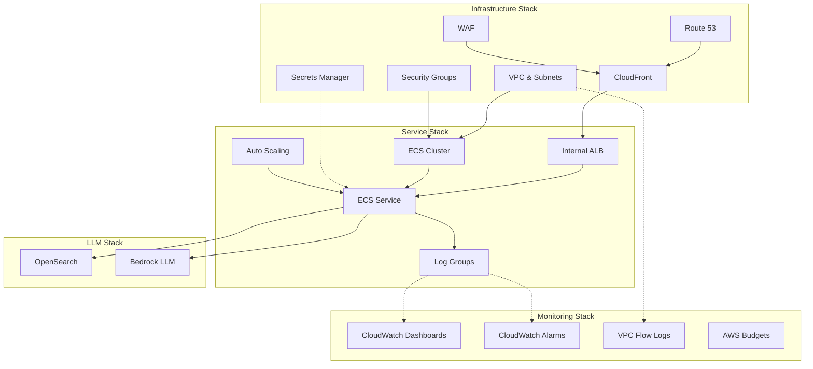

# SiteChatCDK

AWS CDK infrastructure project for deploying and managing the SiteChat application's cloud resources.

## Architecture Overview



## Project Structure

```
.
├── bin/                    # CDK app entry point
├── lib/                    # Stack implementations
│   ├── stacks/            # Individual stacks
│   └── constructs/        # Custom constructs
├── test/                  # Test files
├── config/                # Environment configs
├── memory-bank/          # Project documentation
└── cdk.json              # CDK configuration
```

## Prerequisites

- Node.js 18.x or higher
- npm 9.x or higher
- AWS CLI v2
- AWS CDK CLI
- AWS Account and credentials configured

## Getting Started

1. Install dependencies:
   ```bash
   npm install
   ```

2. Configure AWS credentials:
   ```bash
   aws configure
   ```

3. Bootstrap CDK (first time only):
   ```bash
   cdk bootstrap
   ```

4. Deploy the stacks:
   ```bash
   # Synthesize CloudFormation template
   cdk synth

   # Deploy all stacks
   cdk deploy --all

   # Deploy specific stack
   cdk deploy StackName
   ```

## Stack Organization

### Infrastructure Stack
- Single-AZ VPC with public subnets
- Route 53 DNS management
- CloudFront distribution with caching strategies
- Security groups (CloudFront IPs only)
- WAF configuration with rate limiting
- SSL/TLS certificate management

### Service Stack
- ECS Fargate cluster with Spot instances
- Internal Application Load Balancer
- Auto-scaling configuration (1-4 instances)
- Task definitions with minimal compute (0.25 vCPU, 512MB RAM)
- Log group configuration with 1-week retention
- Secrets Manager integration for API keys

### LLM Stack
- OpenSearch domain (t3.small.search, free tier eligible)
- Bedrock API integration

### Monitoring Stack
- CloudWatch dashboards for key metrics
- CloudWatch alarms for CPU and Memory
- VPC Flow Logs
- AWS Budgets for cost monitoring

## Development

### Local Development
1. Clone the repository
2. Install dependencies
3. Set up AWS credentials
4. Run tests: `npm test`
5. Lint code: `npm run lint`
6. Build project: `npm run build`

### Testing
- Unit tests: `npm test`
- Infrastructure tests: `npm run test:infra`
- Integration tests: `npm run test:integration`

### Deployment
```bash
# Synthesize CloudFormation template
cdk synth

# Deploy all stacks
cdk deploy --all

# Deploy specific stack
cdk deploy StackName
```

### Cost Optimization
- Utilizes Fargate Spot instances
- Free tier eligible resources where possible
- Auto-scaling based on demand (1-4 instances)
- CloudFront caching to reduce origin requests
- Short log retention periods (1 week)
- Single AZ deployment for development/testing

### Security
- Least privilege IAM policies
- Security groups limited to CloudFront IPs
- WAF configuration with rate limiting
- SSL/TLS encryption for all traffic
- Secrets Manager for secure credential storage

## Documentation

- [Project Brief](memory-bank/projectbrief.md)
- [Requirements](requirements.md)
- [Roadmap](roadmap.md)
- [Technical Documentation](memory-bank/techContext.md)
- [System Patterns](memory-bank/systemPatterns.md)

## Contributing

1. Create a feature branch
2. Make changes and test
3. Run linting and tests
4. Submit pull request

## Security

- Follow AWS security best practices
- Use least privilege access
- Implement proper network isolation
- Manage secrets securely
- Regular security reviews

## License

This project is proprietary and confidential.
