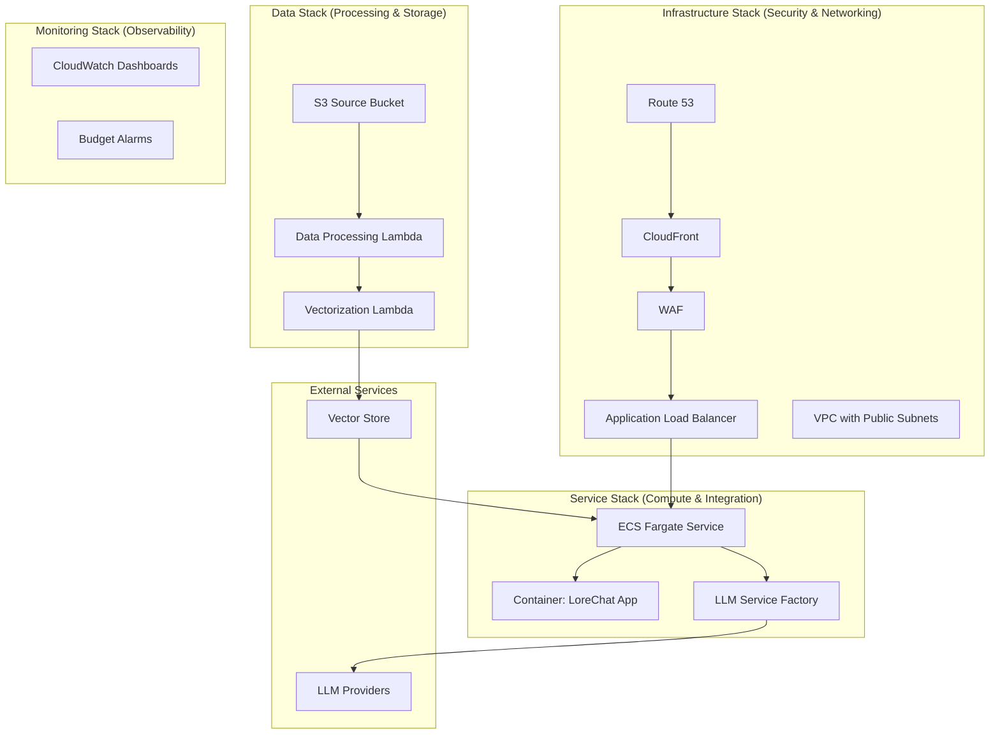
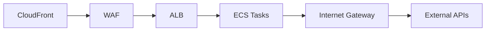
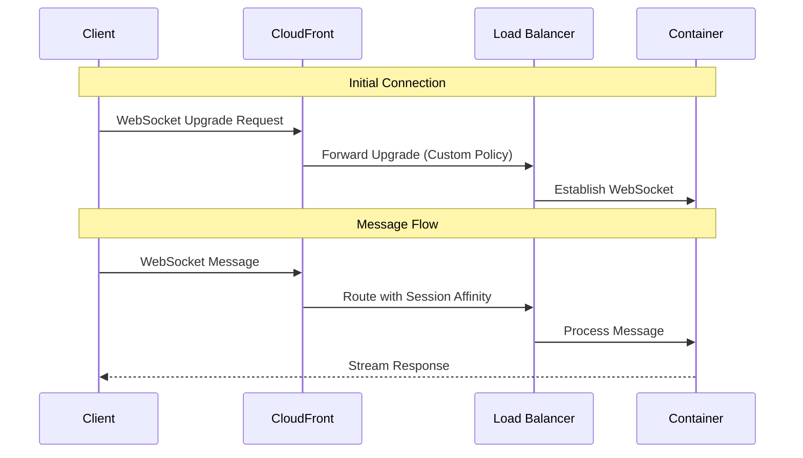
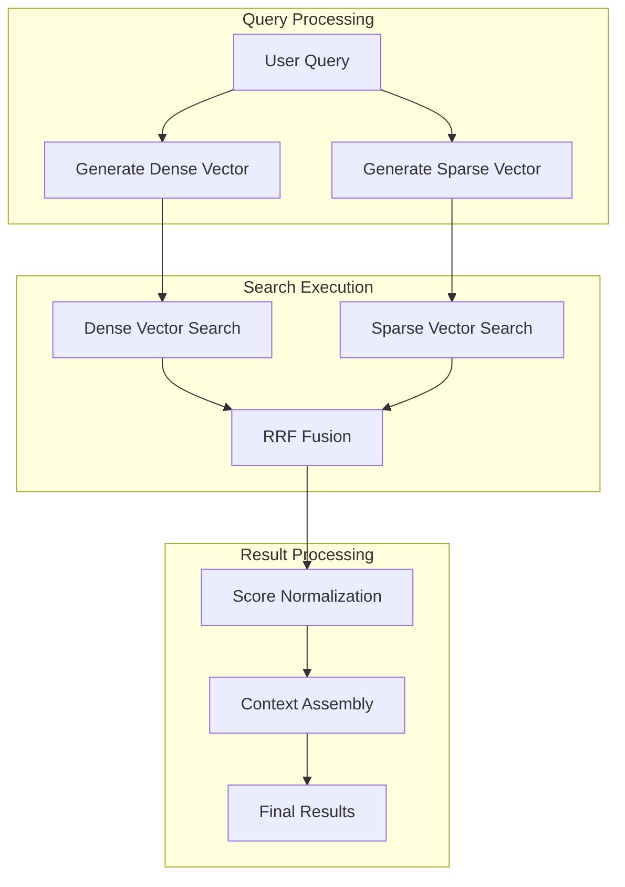
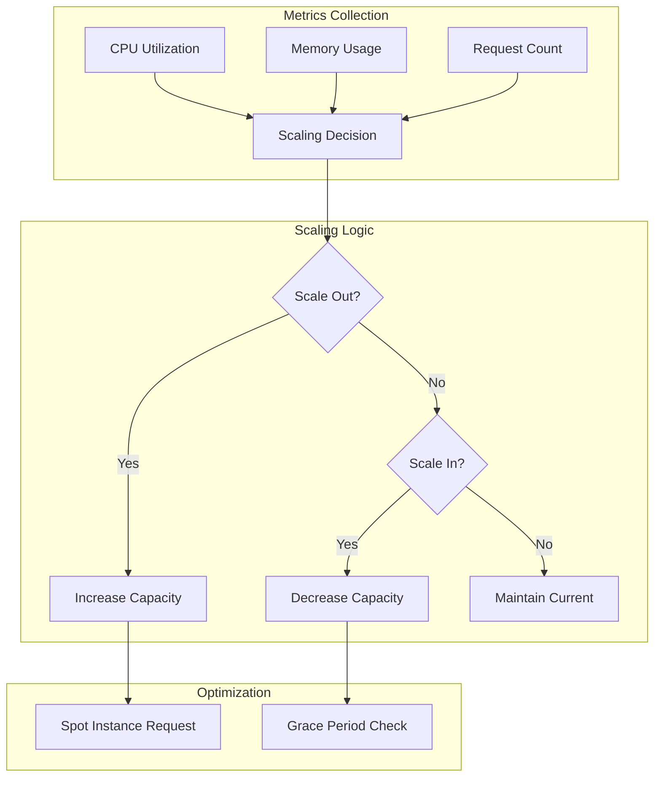
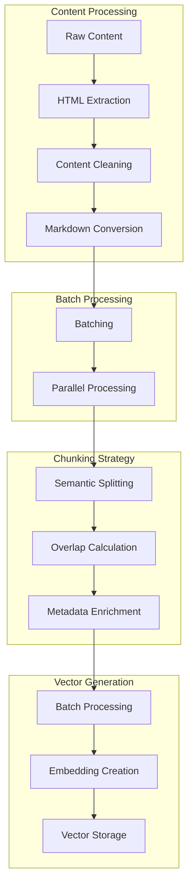

# LoreChatCDK: Cloud Infrastructure for AI-Powered Conversations 🚀

[](https://aws.amazon.com/cdk/)
[](LICENSE)
[](https://en.wikipedia.org/wiki/Infrastructure_as_code)

> A sophisticated AWS CDK infrastructure for an Intelligent Conversational AI Platform

[Detailed Development Guide](DEVELOPMENT.md)

## Project Overview 🎯

Welcome to my GenAI portfolio project. This project implements a production-ready AWS infrastructure using CDK (TypeScript) to power [LoreChat](https://github.com/laialex501/lorechat-container), a Streamlit-based conversational AI platform.

## Technical Highlights 💫

- 🏗️ **Modular Stack Architecture** - Separate infrastructure, service, data, and monitoring stacks
- 🔐 **Security-First Design** - CloudFront + WAF architecture with least-privilege IAM
- 🎭 **Provider-Agnostic AI** - Abstract interfaces for LLM and vector store services. Supports GPT, Claude, and Deepseek.
- 🐳 **Container-Ready** - Deploy consistently across environments
- 🔄 **Intelligent Auto-scaling** - ECS Fargate with spot instance optimization
- 📊 **Comprehensive Monitoring** - Custom CloudWatch dashboards and budget tracking

## System Architecture 🏗️



### Separation of Concerns

Each stack represents a distinct responsibility domain:

1. 🛡️ **Infrastructure Stack**
   - Network isolation with public subnet optimization
   - Edge security through CloudFront + WAF
   - DNS and SSL/TLS management

2. 🚢 **Service Stack**
   - Container orchestration with ECS Fargate
   - Spot instance utilization
   - Service discovery and load balancing

3. 💾 **Data Stack**
   - Structured data processing pipeline
   - Efficient vectorization system
   - Scalable storage architecture

4. 📈 **Monitoring Stack**
   - Real-time performance tracking
   - Cost optimization monitoring
   - Resource utilization insights

## Engineering Decisions & Rationale 🤔

### Key Design Choices

| Component | Implementation | Engineering Rationale |
|-----------|---------------|---------------------|
| **Infrastructure as Code** | AWS CDK with TypeScript | - Strong type safety for infrastructure code<br>- Reusable component patterns<br>- Full programming language capabilities |
| **Compute Layer** | ECS Fargate with Spot | - Simplified container management<br>- Automatic scaling capabilities<br>- Resource optimization through spot instances |
| **Security Architecture** | CloudFront + WAF + Public Subnets | - Edge protection with DDoS mitigation<br>- WebSocket support for real-time features<br>- Optimized network cost through public subnet design |
| **Service Integration** | Factory Pattern | - Provider-agnostic interfaces<br>- Runtime service switching<br>- Simplified vendor migrations |

## Technical Deep Dives & Implementation Details 🔬

### Infrastructure Design

<details>
<summary>💡 <b>AWS CDK Architecture</b> - Infrastructure as Code & Design</summary>
### AWS CDK Architecture - Infrastructure as Code & Design

The choice of AWS CDK with TypeScript emerged from careful consideration of infrastructure management approaches:

**Evaluated Alternatives:**
- CloudFormation: Limited programming capabilities
- Terraform: Stronger provider ecosystem but less AWS integration
- Pulumi: Similar capabilities but smaller community

**CDK Advantages:**
1. Type-safe infrastructure code
2. Native AWS constructs
3. Component reusability
4. Testing capabilities

**Stack Separation Strategy:**
- Isolated blast radius for changes
- Independent deployment capabilities
- Clear responsibility boundaries
- Simplified maintenance
</details>

<details>
<summary>🌐 <b>Network Architecture</b> - Optimized Multi-AZ Design</summary>
### Network Architecture - Optimzied Multi-AZ Design



**Initial Challenge:**
- Need for multi-AZ reliability
- Require external API access
- WebSocket support requirement
- Cost optimization goals
- Security and throttling goals

**Solution Evolution:**
1. Started with API Gateway approach
2. Identified WebSocket limitations
3. Shifted to CloudFront + WAF
4. Implemented public subnet strategy

**Key Design Patterns:**
- Edge security with CloudFront
- Traffic filtering through WAF
- Direct routing for external APIs
- WebSocket protocol support
</details>

<details>
<summary>🔨 <b>Service Integration</b> - Factory Pattern Implementation</summary>
### Service Integrations - Factory Pattern Implementation

The service layer showcases software engineering design patterns:

**Chat Service:**
```python
def create_chat_service():
    """Create or update chat service with current settings."""
    st.session_state.chat_service = ChatService(
        llm_service=LLMFactory.create_llm_service(
            provider=st.session_state.provider,
            model_name=st.session_state.model_name
        ),
        vector_store=VectorStoreFactory.get_vector_store(),
        persona_type=st.session_state.persona
    )
```

**LLM Integration:**
```python

# Factory pattern for service abstraction
llm_service = LLMFactory.create_llm_service(
    provider=LLMProvider.Anthropic,
    model_name=ClaudeModel.SONNET3_5_HAIKU
)

# Provider-agnostic interface
prompt = "Hello world"
response = llmService.generate_response(prompt)
```

**Vector Store Integration:**
```python
# Abstract factory for vector stores
vector_store = VectorStoreFactory.get_vector_store()
query = "Hello world"
documents = vector_store.similarity_search(query, k=3)
```

**Benefits:**
- Runtime provider switching
- Simplified testing
- Reduced vendor lock-in
- Consistent interfaces
</details>

<details>
<summary>🌐 <b>Websocket Connections</b> - Real-time Communication</summary>
### WebSocket Connections - Real-time Communication



**Challenge Faced:**
Initially implemented with API Gateway, but encountered limitations:
- WebSocket connection challenges
- Complex integration with Streamlit
- Higher latency than desired

**Solution Evolution:**
1. Analyzed API Gateway limitations
2. Explored CloudFront capabilities
3. Implemented custom origin policies
4. Added session affinity for stable connections

**Key Configuration:**
```typescript
// CloudFront WebSocket behavior
const webSocketBehavior = new cloudfront.BehaviorOptions({
  allowedMethods: cloudfront.AllowedMethods.ALLOW_ALL,
  originRequestPolicy: new cloudfront.OriginRequestPolicy(this, 'WebSocketPolicy', {
    headerBehavior: cloudfront.OriginRequestHeaderBehavior.allowList(
      'Sec-WebSocket-Key',
      'Sec-WebSocket-Version',
      'Sec-WebSocket-Protocol',
      'Sec-WebSocket-Accept'
    ),
    queryStringBehavior: cloudfront.OriginRequestQueryStringBehavior.all()
  })
});
```
</details>

<details>
<summary>🔍 <b>Hybrid Search Implementation</b> - Vector Search Flow</summary>
### Hybrid Search Implementation - Vector Search Flow


</details>

<details>
<summary>⚖️ <b>Intelligent Auto-scaling Strategy</b></summary>
### Intelligent Auto-scaling Strategy

Our auto scaling strategy allows us to scale up during cloud deployments, when resource usage is high, or when there is a large number of requests.

I chose small defaults for demonstration purposes, but these can easily be configured in production.

```typescript
// ECS Service auto-scaling configuration
const service = new ecs.FargateService(this, 'Service', {
  cluster,
  taskDefinition,
  capacityProviderStrategies: [{
    capacityProvider: 'FARGATE_SPOT',
    weight: 1
  }],
  minHealthyPercent: 50,
  maxHealthyPercent: 200
});

// Auto-scaling based on CPU utilization
const scaling = service.autoScaleTaskCount({
  minCapacity: 1,
  maxCapacity: 4
});
```



**Auto-scaling Configuration:**
```typescript
// Advanced auto-scaling setup
const scaling = service.autoScaleTaskCount({
  maxCapacity: 4,
  minCapacity: 1
});

// CPU-based scaling
scaling.scaleOnCpuUtilization('CpuScaling', {
  targetUtilizationPercent: 70,
  scaleInCooldown: Duration.seconds(60),
  scaleOutCooldown: Duration.seconds(30)
});

// Request count scaling
scaling.scaleOnRequestCount('RequestScaling', {
  targetRequestsPerSecond: 100,
  scaleInCooldown: Duration.seconds(60),
  scaleOutCooldown: Duration.seconds(30)
});
```
</details>

<details>
<summary>📦 <b>Data Processing Pipeline</b> - Vectorization</summary>
### Data Processing Pipeline


</details>

## Development Methodology & Innovation 🛠️

### Key Development Patterns

1. **Infrastructure as Code**
   - Type-safe CDK constructs
   - Reusable component patterns
   - Automated testing capabilities

2. **Security First**
   - Edge protection
   - Least privilege access
   - Encryption by default

3. **Service Abstraction**
   - Factory pattern implementation
   - Provider-agnostic interfaces
   - Runtime configuration

4. **Monitoring & Maintenance**
   - Custom CloudWatch metrics
   - Budget tracking
   - Resource optimization

### Cost Optimization
 
- Utilizes Fargate Spot instances
- Free tier eligible resources where possible
- Auto-scaling based on demand (1-4 instances)
- CloudFront caching to reduce origin requests
- Short log retention periods (1 week)
- Dual AZ deployment for availability

### Security
 
- Least privilege IAM policies
- Implement proper network isolation
- Security groups limited to CloudFront IPs
- WAF configuration with rate limiting
- SSL/TLS encryption for all traffic
- Secrets Manager for secure credential storage

## Future Enhancements 🔮

Planned architectural improvements:

1. **Infrastructure Evolution**
   - Multi-region deployment capability
   - Enhanced disaster recovery
   - Global edge presence

2. **Security Enhancements**
   - VPC endpoint integration
   - Enhanced IAM policies
   - Additional WAF rules

3. **Service Expansion**
   - Voice interaction support
   - Multi-agent orchestration
   - Advanced analytics integration

## Connect & Contribute 🤝

[GitHub](https://github.com/laialex501) | [LinkedIn](https://linkedin.com/in/laialex501)

Licensed under MIT - See [LICENSE](LICENSE) for details
