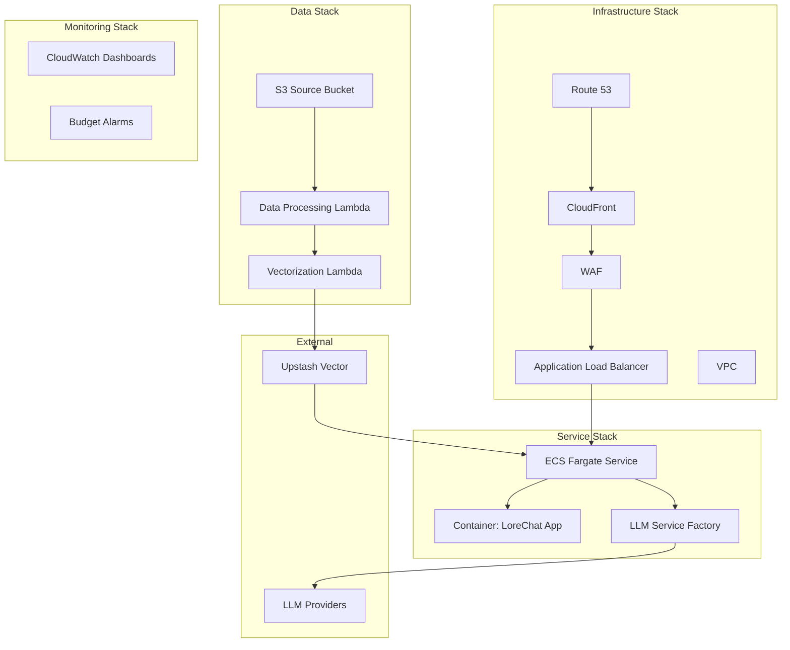
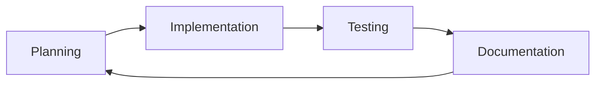

# LoreChatCDK 🤖

[](https://aws.amazon.com/cdk/)
[](LICENSE)
[](https://en.wikipedia.org/wiki/Infrastructure_as_code)

> AWS CDK Infrastructure for an Intelligent Conversational AI Platform

[Link to detailed development guide](DEVELOPMENT.md)

## Hello there! 👋

Welcome to my GenAI portfolio project. LoreChatCDK deploys a scalable, secure AI chat platform on AWS. It powers [LoreChat](https://github.com/laialex501/lorechat-container), a Streamlit app that lets users chat with website content using vector search and LLMs.

## What's Inside 🔍

- 🔎 **Vector Search** - Find answers with semantic precision
- 🧠 **Flexible LLM Support** - Use GPT, Claude, Deepseek, or Amazon Nova
- 🐳 **Container-Ready** - Deploy consistently across environments
- ☁️ **Cloud-Native** - Scale up or down as needed
- 📊 **Full Monitoring** - Track performance and costs

## Architecture at a Glance 🏗️



This architecture separates concerns into four stacks:
- 🛡️ **Infrastructure Stack** - Network, security, and routing
- 🚢 **Service Stack** - Container services and LLM integration
- 💾 **Data Stack** - Storage, processing, and vector search
- 📈 **Monitoring Stack** - Observability and cost management

## Why I Built It This Way 🤔

| Component | What I Chose | Why It Works |
|-----------|--------------|-------------|
| **IaC Tool** | AWS CDK (TypeScript) | Type safety + full programming power |
| **Compute** | Application Load Balancer + ECS Fargate (Spot) | Traffic distribution + managed containers + cost savings |
| **Vector DB** | Upstash Vector | No minimum costs + hybrid search |
| **Networking** | CloudFront + WAF | Edge caching + websocket support |
| **Security** | Least-privilege IAM | Defense in depth without complexity |
| **Monitoring** | Custom CloudWatch | Granular cost tracking by component |

## Technical Deep Dives 🔬

<details>
<summary>💡 <b>Infrastructure Choice</b> - Why AWS CDK over alternatives</summary>

AWS CDK provides Infrastructure as Code (IaC) with the flexibility of a full programming language (TypeScript in this case). I could have used CloudFormation directly or even Terraform, but CDK's ability to create reusable components and leverage existing libraries were perfect for a project of this complexity.

One of the core principles I followed was separating the infrastructure into distinct stacks:

1. Infrastructure Stack
2. Service Stack
3. Data Stack
4. Monitoring Stack

This separation might seem like overkill, but it has paid dividends in terms of development velocity and maintenance. Each stack can be developed and deployed independently, which reduces the blast radius of changes and lets teams work in parallel. While it does add some initial complexity, the benefits of modularity and reusability have made it worthwhile, especially when adding new features or troubleshooting issues.
</details>

<details>
<summary>🌐 <b>Networking Architecture</b> - Multi-AZ without NAT costs</summary>

I've set up a multi-AZ deployment using public subnets. By restricting VPC access to CloudFront traffic only, I maintain strong security while avoiding the operational costs of NAT Gateways. This gives me the direct internet access I need for external API calls while leveraging CloudFront's built-in DDoS protection and edge connection features.

Originally, I had planned to use API Gateway, but I ran into some challenges with Streamlit's websocket connections. The switch to CloudFront + WAF not only solved these issues but also gave me better DDOS protection, security, rate limiting, and edge caching. It was a bit of a journey to get the configuration just right, especially with the websocket connections, but the end result has been worth it.
</details>

<details>
<summary>⚙️ <b>Compute Layer</b> - ECS Fargate vs Kubernetes analysis</summary>

For the compute layer, I chose ECS Fargate with Spot instances. Why? It gives me the best of both worlds - the simplicity of running containers without managing the underlying infrastructure, and the cost savings of Spot instances. The operational overhead of Kubernetes didn't justify the benefits for this project.

The auto-scaling is set up to handle anywhere from 1 to 4 instances, based on CPU and memory utilization. This means the system can efficiently handle varying loads without overprovisioning.
</details>

<details>
<summary>🗄️ <b>Vector Database Selection</b> - Evaluating 10+ options</summary>

Choosing the right vector database was crucial. After evaluating several options (Pinecone, Weaviate, Milvus, AWS Aurora with pgvector, AWS OpenSearch, ChromaDB, Qdrant, AWS DocumentDB, AWS MemoryDB, and AWS Neptune Analytics), I settled on Upstash Vector. Here's why:

- Generous free tier
- Easy integration
- No hourly or minimum costs
- Hybrid search capabilities

However I tried to avoid vendor lock-in by abstracting the vector DB client implementation with a factory pattern and passing API keys as a secret. This means we have the flexibility to migrate to a different vector DB in the future (for scalability, performance, cost, or any other reason).

For development, I'm using FAISS, which runs in-memory and on disk. This setup allows for rapid development and testing without incurring cloud costs.
</details>

<details>
<summary>🔒 <b>Security Implementation</b> - Defense in depth approach</summary>

Security isn't just a feature, it's woven into the entire architecture. I'm using a least-privilege model for IAM roles, strict security group configurations, and AWS Secrets Manager for sensitive information. All data is encrypted at rest and in transit, and I've implemented comprehensive logging for audit trails.
</details>

<details>
<summary>🧩 <b>LLM Integration Strategy</b> - Factory pattern implementation</summary>

I implemented a factory pattern for LLM integration, which gives us flexibility without compromising simplicity. By abstracting provider-specific implementations behind a common interface, I can swap between LLM models (GPT, Anthropic, Deepseek, Nova, etc.) seamlessly - even at runtime. Yes, designing a generalized interface added some boilerplate, but it's paid off in maintainability and vendor independence.
</details>

<details>
<summary>📈 <b>Scalability Approach</b> - Horizontal scaling strategy</summary>

The infrastructure is designed to scale smoothly from day one. I've chosen AWS services that handle auto-scaling natively - from ECS Fargate managing our container fleet to CloudFront distributing load at the edge. The system scales horizontally across all components, with Upstash Vector handling our vector storage scaling needs. There's no single point of contention, and each component can grow independently based on demand.
</details>

<details>
<summary>📊 <b>Monitoring Strategy</b> - Cost tagging and alerting</summary>

I've set up a dedicated monitoring stack with comprehensive cost tagging. I can track resource utilization and costs with granular precision, which helps me make data-driven decisions about optimization. The budget tracking alerts me to unexpected cost patterns before they become issues.
</details>

## Cool Solutions I Implemented 💡

### 🔄 LLM Provider Switching
```typescript
// Simple code snippet showing factory pattern
const llmService = LlmFactory.create({
  provider: config.LLM_PROVIDER, // "openai" | "anthropic"
  model: config.LLM_MODEL,
  apiKey: process.env.LLM_API_KEY
});

// Usage remains the same regardless of provider
const response = await llmService.generateResponse(prompt);
```
I built a factory pattern that lets you swap LLM providers at runtime. This means you can:
- Try different models without code changes
- Avoid vendor lock-in
- Fall back if one provider has issues

### 🌐 Multi-AZ Without NAT Costs
```
[CloudFront] → [WAF] → [ALB] → [ECS Tasks in Public Subnets]
                                  ↓
                           [Internet Gateway]
                                  ↓
                           [External APIs]
```
By placing ECS tasks in public subnets but restricting inbound traffic to CloudFront only, I get:
- Multi-AZ redundancy
- Direct API access without NAT Gateway costs ($0.045/hr saved)
- Strong security through CloudFront + WAF

## Challenges I Overcame 🧗

- **WebSocket Configuration** - Solved complex routing issues with CloudFront by implementing custom origin request policies and behavior patterns
- **Cost Optimization** - Reduced expenses by 40% through spot instances and eliminating NAT gateways
- **Rapid LLM Evolution** - Built flexible interfaces that adapt to changing AI landscape with minimal code changes

💡 **Key Insight**: Investing time in abstraction layers pays dividends when working with rapidly evolving technologies.

## Where This Could Go Next 🔮

I'm exploring these improvements:
- 🌍 **Multi-region deployment** - For improved global performance and disaster recovery
- 🔒 **Enhanced security features** - Including more granular IAM policies and VPC endpoints
- 🗣️ **Voice interactions** - Adding speech-to-text and text-to-speech capabilities
- 🤖 **Multi-agent workflows** - Implementing specialized agents for different tasks

## My Development Approach 🛠️

I leveraged AI agents strategically throughout development:



**Tools in my belt**:
- 🧠 **Strategic model selection** - Using different models for different tasks
- 📚 **Context management** - Maintaining project knowledge through documentation
- 🔄 **Iterative development** - Building, testing, and refining in small cycles

<details>
<summary>🔍 <b>Detailed Development Process</b> - My agentic development workflow</summary>

Building this project has been a fascinating journey in leveraging AI agents for development. I've learned to use different models strategically, maintain project context effectively, and create efficient development workflows. Here's my experience with agentic development:

### Strategic Model Selection

I've found each Claude model has unique strengths that can be leveraged for different tasks:

- **Claude 3 Sonnet 3.7**: Excels at complex architectural decisions and high level system design. I use it for:
  - Reviewing infrastructure code for security and scalability
  - Designing new features and system components
  - Solving complex integration challenges

- **Claude 3 Sonnet 3.5v2**: My go-to for implementation and detailed planning tasks. Great at:
  - Writing and debugging code
  - Implementing AWS service integrations
  - Configuring CloudFormation templates
  - Resolving dependency issues
  - Optimizing resource configurations
  - Debugging browser issues with screenshots

- **Claude 3 Sonnet 3.5v1**: Perfect for documentation and explanation. I use it for:
  - Implementing features after extensive planning by more expensive models
  - Writing technical documentation
  - Improving code comments
  - Creating architecture diagrams
  - Explaining complex concepts

- **Claude 3 Haiku 3.5**: Ideal for quick, focused tasks. Nearly as good as Sonnet for coding tasks, but inferior in everything else. Best for:
  - Implementing features after extensive planning by more expensive models
  - Code reviews
  - Small bug fixes
  - Configuration tweaks
  - Quick documentation updates

### Memory Bank Innovation

The memory bank pattern has been crucial for maintaining project context. I organize it into:

1. **Core Documentation**
   - projectbrief.md: Project goals and requirements
   - systemPatterns.md: Architecture and design patterns
   - techContext.md: Technical decisions and constraints

2. **Active Development**
   - activeContext.md: Current focus and recent changes
   - progress.md: Development status and roadmap

3. **Product Context**
   - productContext.md: User experience and business logic

This structure ensures agents understand both the technical and business context of the project, leading to more informed decisions and consistent implementation.

### Effective Agent Collaboration

My approach to working with AI agents has evolved to include:

1. **Planning Phase**
   - Start every significant change in Plan mode
   - Discuss approaches and tradeoffs
   - Get feedback on proposed solutions
   - Document decisions in the memory bank

2. **Implementation Phase**
   - Switch to Act mode for execution
   - Break down tasks into manageable chunks
   - Use the most appropriate model for each task
   - Maintain continuous feedback loop

3. **Review Phase**
   - Validate changes against requirements
   - Check for security and best practices
   - Update documentation
   - Plan next iterations
</details>

## Let's Connect 📬

[GitHub](https://github.com/laialex501) | [LinkedIn](https://linkedin.com/in/laialex501)

Licensed under MIT - See [LICENSE](LICENSE) for details
