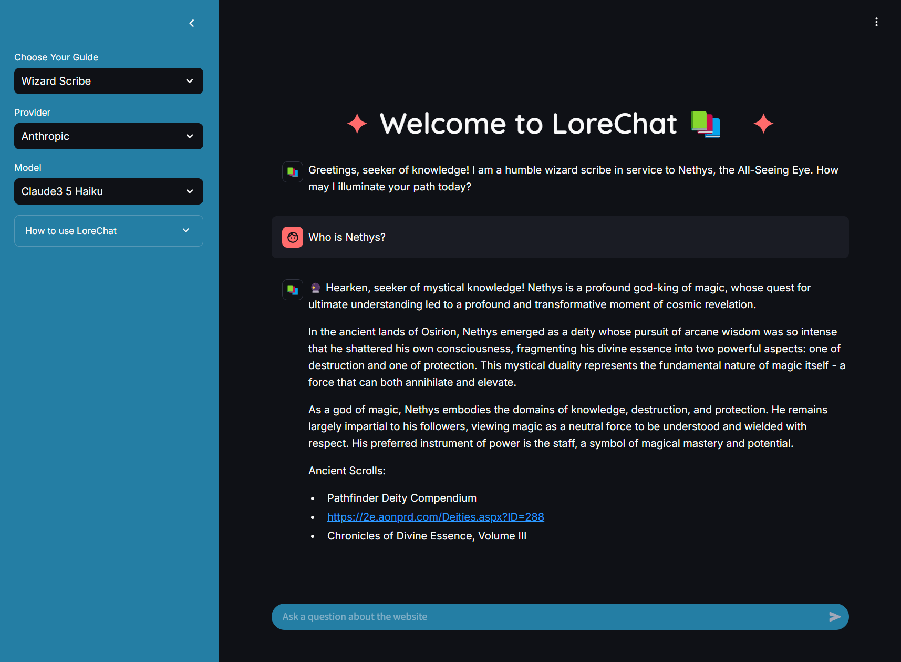
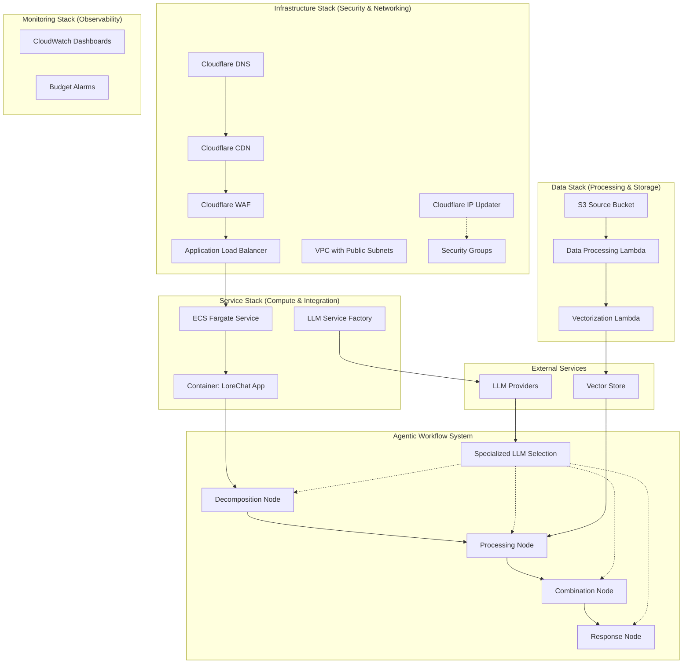
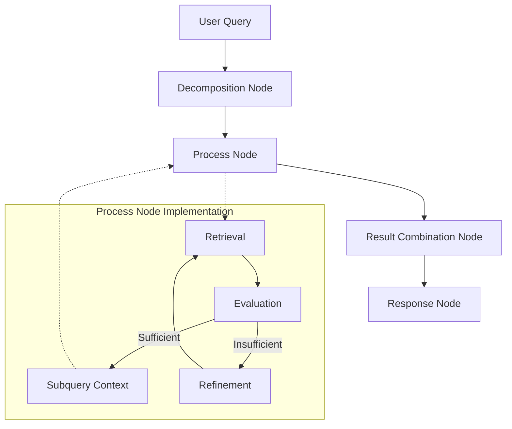
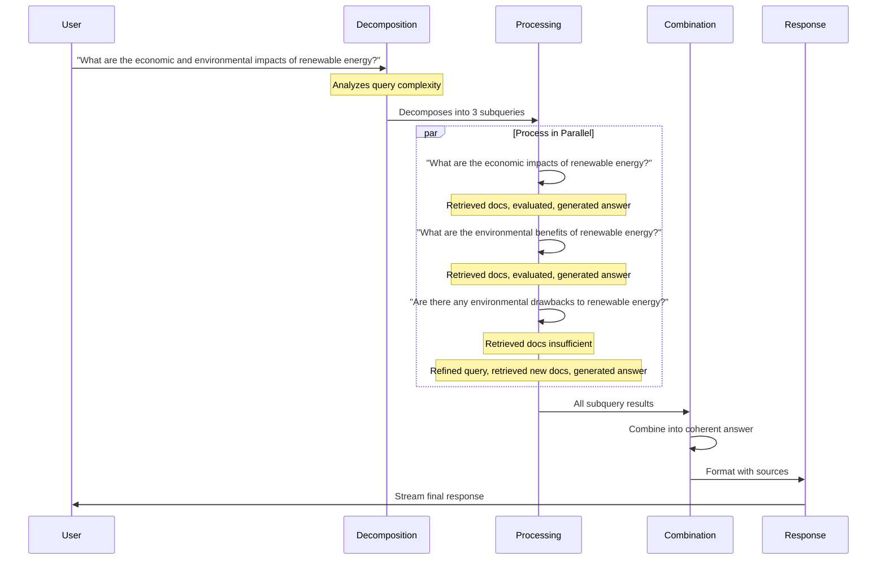
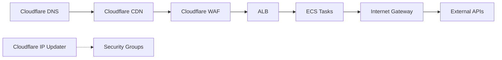
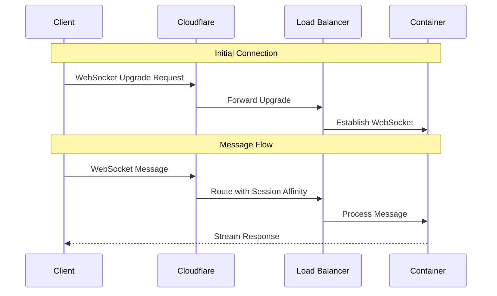
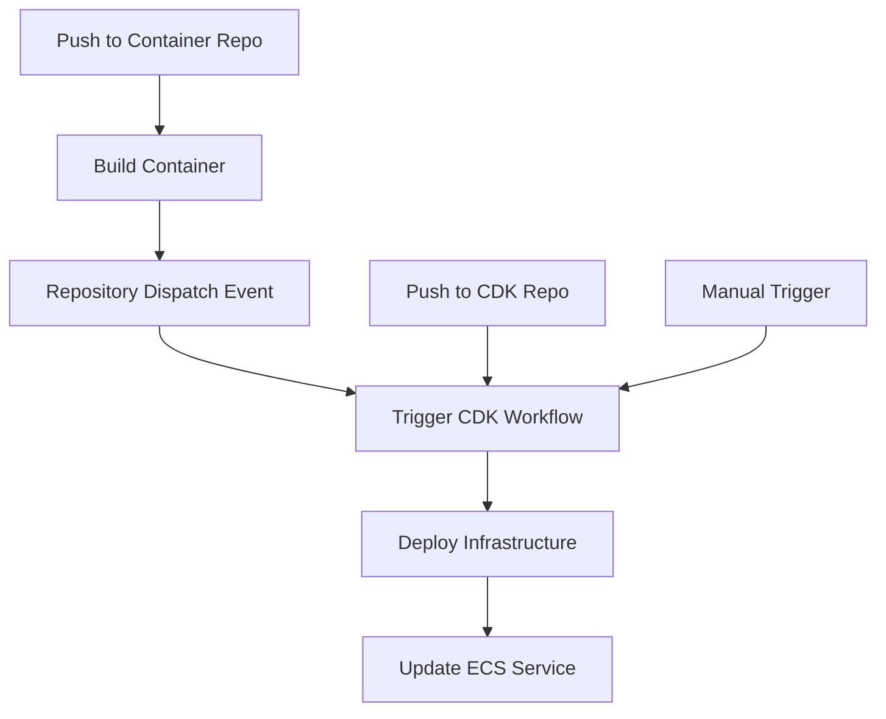
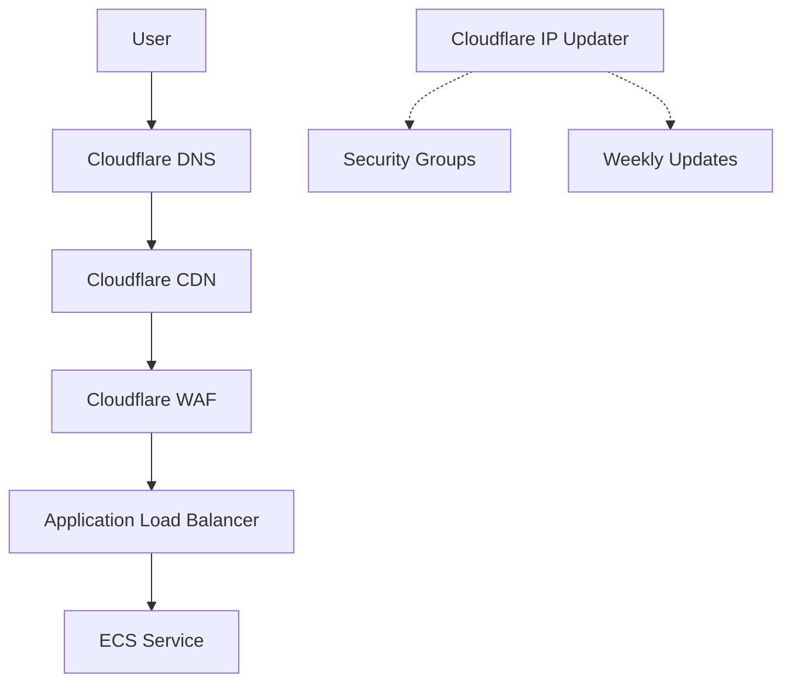

# LoreChatCDK: Cloud Infrastructure for AI-Powered Conversations 🚀

[](https://aws.amazon.com/cdk/)
[](LICENSE)
[](https://en.wikipedia.org/wiki/Infrastructure_as_code)

> A sophisticated AWS CDK infrastructure for an Intelligent Conversational AI Platform

[Detailed Development Guide](DEVELOPMENT.md)

## Project Overview 🎯

Welcome to my GenAI portfolio project. This project implements a production-ready AWS infrastructure using CDK (TypeScript) to power [LoreChat](https://github.com/laialex501/lorechat-container).

LoreChat is a Streamlit-based conversational AI chat platform that makes website content interactive through smart conversations. It uses an agentic workflow and retrieval-augmented-generation (RAG) to intelligently answer user queries.



The system works through four connected parts:
- It breaks complex questions into smaller parts
- It processes all parts at the same time using parallel computing
- It combines all answers into one coherent response
- It adds clear source links to show where information came from

LoreChat uses hybrid search with both meaning-based vectors and keyword matching. By working on multiple question aspects at once, it delivers faster responses.

The system smartly assigns different AI models to tasks they do best. This optimizes both cost and performance.

It is built with modern AI tools like LangChain and LangGraph, and works with OpenAI, Anthropic, and other providers. It runs smoothly in the cloud using Docker.

## Technical Highlights 💫

- 🏗️ **Modular Stack Architecture** - Separate infrastructure, service, data, and monitoring stacks
- 🔐 **Security-First Design** - Cloudflare WAF + CDN architecture with least-privilege IAM
- 🧠 **Agentic Workflow System** - Graph-based query decomposition and parallel processing
- 🎭 **Provider-Agnostic AI** - Abstract interfaces for LLM and vector store services. Supports GPT, Claude, and Deepseek.
- 🐳 **Container-Ready** - Deploy consistently across environments
- 🔄 **Intelligent Auto-scaling** - ECS Fargate with spot instance optimization
- 📊 **Comprehensive Monitoring** - Custom CloudWatch dashboards and budget tracking

## System Architecture 🏗️



### Separation of Concerns

Each stack represents a distinct responsibility domain:

1. 🛡️ **Infrastructure Stack**
   - Network isolation with public subnet optimization
   - Edge security through Cloudflare CDN + WAF
   - DNS and SSL/TLS management with Cloudflare
   - Automatic security group updates with Cloudflare IP ranges

2. 🚢 **Service Stack**
   - Container orchestration with ECS Fargate
   - Spot instance utilization
   - Service discovery and load balancing
   - Agentic workflow system integration

3. 💾 **Data Stack**
   - Structured data processing pipeline
   - Efficient vectorization system
   - Scalable storage architecture

4. 📈 **Monitoring Stack**
   - Real-time performance tracking
   - Cost optimization monitoring
   - Resource utilization insights

## Engineering Decisions & Rationale 🤔

### Key Design Choices

| Component | Implementation | Engineering Rationale |
|-----------|---------------|---------------------|
| **Infrastructure as Code** | AWS CDK with TypeScript | - Strong type safety for infrastructure code<br>- Reusable component patterns<br>- Full programming language capabilities |
| **Compute Layer** | ECS Fargate with Spot | - Simplified container management<br>- Automatic scaling capabilities<br>- Resource optimization through spot instances |
| **Agentic System** | LangGraph with Specialized LLMs | - Query decomposition for complex questions<br>- Parallel processing for efficiency<br>- Specialized LLM selection for different reasoning tasks |
| **Security Architecture** | Cloudflare CDN + WAF + Public Subnets | - Edge protection with DDoS mitigation<br>- WebSocket support for real-time features<br>- Optimized network cost through public subnet design<br>- Automated CAPTCHA for bots |
| **Service Integration** | Factory Pattern | - Provider-agnostic interfaces<br>- Runtime service switching<br>- Simplified vendor migrations |

## Technical Deep Dives & Implementation Details 🔬

### Infrastructure Design

<details>
<summary>💡 <b>AWS CDK Architecture</b> - Infrastructure as Code & Design</summary>
### AWS CDK Architecture - Infrastructure as Code & Design

The choice of AWS CDK with TypeScript emerged from careful consideration of infrastructure management approaches:

**Evaluated Alternatives:**
- CloudFormation: Limited programming capabilities
- Terraform: Stronger provider ecosystem but less AWS integration
- Pulumi: Similar capabilities but smaller community

**CDK Advantages:**
1. Type-safe infrastructure code
2. Native AWS constructs
3. Component reusability
4. Testing capabilities

**Stack Separation Strategy:**
- Isolated blast radius for changes
- Independent deployment capabilities
- Clear responsibility boundaries
- Simplified maintenance
</details>

<details>
<summary>🧠 <b>Agentic Workflow System</b> - Graph-based Intelligent Processing</summary>
### Agentic Workflow System - Graph-based Intelligent Processing

The agentic workflow system represents a significant advancement in conversational AI capabilities, enabling sophisticated query handling through a graph-based approach:



**Architectural Decision Points:**

1. **Graph vs. Chain Structure**
   - **Challenge**: Traditional chain-based approaches lack flexibility for complex reasoning
   - **Solution**: Implemented explicit graph structure with specialized nodes
   - **Benefit**: Clear reasoning paths, better error isolation, and explicit state transitions

2. **Query Decomposition Strategy**
   - **Challenge**: Complex queries require multi-faceted understanding
   - **Solution**: Implemented intelligent decomposition into subqueries
   - **Benefit**: More comprehensive answers through specialized processing

3. **Parallel Processing Architecture**
   - **Challenge**: Sequential processing creates high latency
   - **Solution**: Implemented asyncio-based parallel subquery processing
   - **Benefit**: Significantly reduced response time for complex queries

4. **Specialized LLM Selection**
   - **Challenge**: Different reasoning tasks require different model capabilities
   - **Solution**: Implemented node-specific LLM selection
   - **Benefit**: Optimized cost-performance balance with specialized reasoning

**Infrastructure Integration:**

The agentic system is containerized and deployed through our ECS Fargate service, with several key infrastructure considerations:

1. **Compute Requirements**
   - Higher memory allocation for parallel processing
   - CPU optimization for concurrent operations
   - Auto-scaling based on query complexity patterns

2. **Networking Considerations**
   - WebSocket support for streaming responses
   - Session affinity for consistent user experience
   - Optimized connection handling for multiple LLM calls

3. **Monitoring Integration**
   - Custom CloudWatch metrics for node performance
   - Specialized logging for reasoning paths
   - Performance tracking across different query types

**Real-world Example Flow:**



This sophisticated system enables LoreChat to handle complex, multi-faceted queries with greater depth and accuracy than traditional approaches, while maintaining reasonable response times through parallel processing and specialized model selection.
</details>

<details>
<summary>🌐 <b>Network Architecture</b> - Optimized Multi-AZ Design</summary>
### Network Architecture - Optimized Multi-AZ Design



**Initial Challenge:**
- Need for multi-AZ reliability
- Require external API access
- WebSocket support requirement
- Cost optimization goals
- Security and throttling goals

**Solution Evolution:**
1. Started with API Gateway approach
2. Identified WebSocket limitations
3. Shifted to CloudFront + WAF
4. Evolved to Cloudflare CDN + WAF
5. Implemented public subnet strategy
6. Added automatic Cloudflare IP range updates

**Key Design Patterns:**
- Edge security with Cloudflare
- Traffic filtering through Cloudflare WAF
- Direct routing for external APIs
- WebSocket protocol support
- Automated security group management
</details>

<details>
<summary>🔨 <b>Service Integration</b> - Factory Pattern Implementation</summary>

The service layer showcases software engineering design patterns:

**Chat Service:**
```python
def create_chat_service():
    """Create or update chat service with current settings."""
    st.session_state.chat_service = ChatService(
        llm_service=LLMFactory.create_llm_service(
            provider=st.session_state.provider,
            model_name=st.session_state.model_name
        ),
        vector_store=VectorStoreFactory.create_vector_store(),
        persona_type=st.session_state.persona
    )
```

**LLM Integration:**
```python

# Factory pattern for service abstraction
llm_service = LLMFactory.create_llm_service(
    provider=LLMProvider.Anthropic,
    model_name=ClaudeModel.SONNET3_5_HAIKU
)

# Provider-agnostic interface
prompt = "Hello world"
response = llmService.generate_response(prompt)
```

**Vector Store Integration:**
```python
# Abstract factory for vector stores
vector_store = VectorStoreFactory.create_vector_store()
query = "Hello world"
documents = vector_store.similarity_search(query, k=3)
```

**Benefits:**
- Runtime provider switching
- Simplified testing
- Reduced vendor lock-in
- Consistent interfaces
</details>

<details>
<summary>🌐 <b>Websocket Connections</b> - Real-time Communication</summary>



**Challenge Faced:**
Initially implemented with API Gateway, but encountered limitations:
- WebSocket connection challenges
- Complex integration with Streamlit
- Higher latency than desired

**Solution Evolution:**
1. Analyzed API Gateway limitations
2. Explored CloudFront capabilities
3. Implemented custom origin policies
4. Evolved to Cloudflare for simplified WebSocket support
5. Added session affinity for stable connections

**Key Configuration:**
- Cloudflare WebSocket support enabled through dashboard
- ALB configured to handle WebSocket connections
- Security groups automatically updated with Cloudflare IP ranges
</details>

<details>
<summary>🔍 <b>Hybrid Search Implementation</b> - Vector Search Flow</summary>


</details>

<details>
<summary>⚖️ <b>Intelligent Auto-scaling Strategy</b></summary>

Our auto scaling strategy allows us to scale up during cloud deployments, when resource usage is high, or when there is a large number of requests.

I chose small defaults for demonstration purposes, but these can easily be configured in production.

```typescript
// ECS Service auto-scaling configuration
const service = new ecs.FargateService(this, 'Service', {
  cluster,
  taskDefinition,
  capacityProviderStrategies: [{
    capacityProvider: 'FARGATE_SPOT',
    weight: 1
  }],
  minHealthyPercent: 50,
  maxHealthyPercent: 200
});

// Auto-scaling based on CPU utilization
const scaling = service.autoScaleTaskCount({
  minCapacity: 1,
  maxCapacity: 4
});
```


**Auto-scaling Configuration:**
```typescript
// Advanced auto-scaling setup
const scaling = service.autoScaleTaskCount({
  maxCapacity: 4,
  minCapacity: 1
});

// CPU-based scaling
scaling.scaleOnCpuUtilization('CpuScaling', {
  targetUtilizationPercent: 70,
  scaleInCooldown: Duration.seconds(60),
  scaleOutCooldown: Duration.seconds(30)
});

// Request count scaling
scaling.scaleOnRequestCount('RequestScaling', {
  targetRequestsPerSecond: 100,
  scaleInCooldown: Duration.seconds(60),
  scaleOutCooldown: Duration.seconds(30)
});
```
</details>

<details>
<summary>📦 <b>Data Processing Pipeline</b> - Vectorization</summary>


</details>

## Development Methodology & Innovation 🛠️

### Key Development Patterns

1. **Infrastructure as Code**
   - Type-safe CDK constructs
   - Reusable component patterns
   - Automated testing capabilities

2. **Security First**
   - Edge protection
   - Least privilege access
   - Encryption by default

3. **Service Abstraction**
   - Factory pattern implementation
   - Provider-agnostic interfaces
   - Runtime configuration

4. **Agentic Processing**
   - Graph-based workflow
   - Parallel subquery handling
   - Specialized LLM selection

5. **Monitoring & Maintenance**
   - Custom CloudWatch metrics
   - Budget tracking
   - Resource optimization

### Cost Optimization
 
- Utilizes Fargate Spot instances
- Free tier eligible resources where possible
- Auto-scaling based on demand (1-4 instances)
- CloudFront caching to reduce origin requests
- Short log retention periods (1 week)
- Dual AZ deployment for availability
- Specialized LLM selection to optimize cost-performance ratio

### Security
 
- Least privilege IAM policies
- Implement proper network isolation
- Security groups automatically updated with Cloudflare IP ranges
- Cloudflare WAF with Bot Fight Mode and rate limiting
- SSL/TLS encryption for all traffic (Full Strict mode)
- Secrets Manager for secure credential storage

## CI/CD Pipeline & Deployment Flow 🚀



Our CI/CD pipeline uses GitHub Actions to create a seamless deployment flow:

1. **Container Updates**
   - Push to the container repo builds a new image
   - GitHub Actions sends a repository dispatch event to the CDK repo
   - The image tag is passed as a client payload

2. **Infrastructure Updates**
   - Push to the CDK repo triggers deployment
   - Manual triggers are available for controlled deployments
   - OIDC authentication ensures secure AWS access

3. **Deployment Process**
   - AWS CDK handles infrastructure changes
   - ECS service updates with new container images
   - Zero-downtime deployments with rolling updates

This workflow ensures that both application and infrastructure changes deploy smoothly and securely.

## Cloudflare Integration & Security 🛡️



Our Cloudflare integration provides multiple layers of protection:

1. **Edge Security**
   - DDoS protection at the network edge
   - Bot Fight Mode with automated CAPTCHA
   - Rate limiting to prevent abuse
   - WAF rules to block common attacks

2. **Secure Communication**
   - Full Strict SSL/TLS mode
   - End-to-end encryption
   - WebSocket support for real-time features
   - Session affinity for stable connections

3. **Automated Security Updates**
   - Weekly Lambda function updates security groups
   - CIDR aggregation handles AWS rule limits
   - Only traffic from Cloudflare IPs reaches ALB
   - Automatic adaptation to Cloudflare network changes

This multi-layered approach ensures robust protection while maintaining performance and real-time capabilities.

### Why Cloudflare Over CloudFront

Our infrastructure evolved from API Gateway to CloudFront before finally settling on Cloudflare for several compelling reasons:

1. **Superior Bot Protection**
   - Bot Fight Mode with automated CAPTCHA challenges for suspicious traffic
   - "I'm Under Attack Mode" for enhanced protection during targeted attacks
   - Advanced bot detection that reduces costs by preventing unnecessary LLM calls

2. **Simplified Rule Management**
   - Intuitive dashboard for creating and managing security rules
   - Flexible WAF rule configuration without complex CloudFormation templates
   - Page Rules for URL-specific behaviors and optimizations
   - Rate limiting rules with fine-grained control

3. **Streamlined WebSocket Support**
   - Native WebSocket protocol support with minimal configuration
   - Session affinity for stable real-time connections
   - Simplified handling of streaming responses from LLMs
   - Lower latency for real-time chat interactions

4. **Cost Efficiency**
   - Generous free tier for development and smaller deployments
   - Predictable pricing model
   - No charges for request handling (unlike CloudFront)
   - Reduced operational costs for similar performance characteristics

5. **Additional Benefits**
   - Integrated DNS management with automatic HTTPS
   - More global points of presence for lower latency
   - CIDR aggregation to handle AWS security group rule limits
   - Weekly automated security group updates via Lambda
   - Simplified SSL/TLS certificate management
   - Enhanced caching controls for static assets

## Future Enhancements 🔮

Planned architectural improvements:

1. **Infrastructure Evolution**
   - Multi-region deployment capability
   - Enhanced disaster recovery
   - Global edge presence

2. **Security Enhancements**
   - VPC endpoint integration
   - Enhanced IAM policies
   - Additional WAF rules

3. **Service Expansion**
   - Voice interaction support
   - Multi-agent orchestration
   - Advanced analytics integration

4. **Agentic System Enhancements**
   - Multi-hop reasoning capabilities
   - Dynamic LLM selection based on query characteristics
   - Adaptive decomposition strategies
   - Feedback loop for continuous improvement

## Connect & Contribute 🤝

[GitHub](https://github.com/laialex501) | [LinkedIn](https://www.linkedin.com/in/alexhlai)

Licensed under MIT - See [LICENSE](LICENSE) for details
