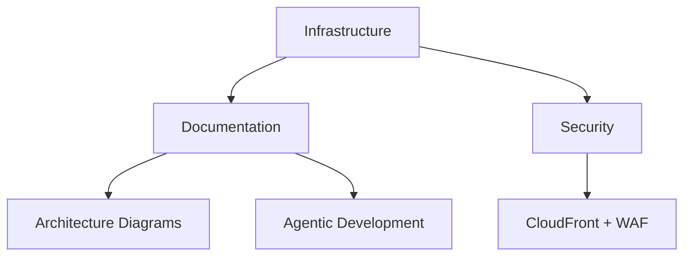

# LoreChatCDK Active Context

## Current Status
Phase 4: Documentation and Agentic Development Integration

### Recent Updates
1. **Technical Documentation Enhancement**
   - Added detailed WebSocket evolution documentation
   - Implemented comprehensive data flow diagrams
   - Created hybrid search implementation details
   - Enhanced auto-scaling strategy documentation
   - Added data processing pipeline visualization

2. **Infrastructure Documentation**
   - Detailed CloudFront + WAF configuration
   - WebSocket handling with custom policies
   - Auto-scaling implementation details
   - Service factory pattern examples

3. **System Flow Documentation**
   - Request lifecycle sequence diagrams
   - Data processing flow visualization
   - Auto-scaling decision flow
   - Error handling strategies

4. **Code Examples & Implementation**
   - WebSocket configuration snippets
   - Hybrid search implementation code
   - Auto-scaling configuration details
   - Data processing pipeline code

## Current Focus

### Completed

### In Progress
- Memory bank synchronization with new technical details
- Documentation refinement for implementation specifics
- Code example enhancement and validation
- Technical deep dive expansion
- System flow diagram updates

### Recently Completed
1. **Technical Deep Dives**
   - WebSocket evolution documentation
   - Hybrid search implementation details
   - Auto-scaling strategy documentation
   - Data processing pipeline visualization

2. **Implementation Details**
   - CloudFront WebSocket configuration
   - Factory pattern implementations
   - Auto-scaling setup
   - Data processing optimizations

### Known Issues
1. **Documentation Maintenance**
   - Keeping technical details synchronized
   - Maintaining code example accuracy
   - Updating flow diagrams as system evolves
   - Balancing detail vs. readability

2. **Technical Depth**
   - Error handling documentation needs expansion
   - Performance optimization details to be added
   - Testing strategy documentation needed
   - Security implementation details to enhance

## Next Actions

### Immediate
1. Technical Documentation
   - Add error handling details
   - Expand testing strategies
   - Document performance optimizations
   - Enhance security implementation details

2. System Flows
   - Add error recovery flows
   - Document scaling scenarios
   - Enhance monitoring flows
   - Update integration patterns

3. Code Examples
   - Add error handling snippets
   - Include testing examples
   - Document configuration patterns
   - Show monitoring setup

### Short Term
1. Multi-region deployment planning
2. Enhanced disaster recovery
3. Voice interaction features
4. Multi-agentic workflows

## Technical Focus
- Agentic development optimization
- Infrastructure documentation
- Testing enhancement
- Feature expansion

## Current Risks
1. **Documentation**
   - Technical detail accuracy
   - Code example maintenance
   - Diagram synchronization
   - Implementation clarity

2. **Technical Depth**
   - Balance of detail vs. accessibility
   - Code example completeness
   - System flow accuracy
   - Configuration coverage

3. **Maintenance**
   - Keeping documentation current
   - Updating technical details
   - Maintaining flow diagrams
   - Synchronizing code examples

4. **Future Updates**
   - Documenting system evolution
   - Updating technical decisions
   - Maintaining implementation details
   - Evolving architecture documentation
