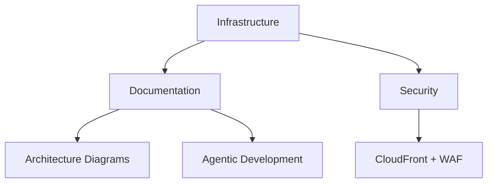

# LoreChatCDK Active Context

## Current Status
Phase 4: Documentation and Agentic Development Integration

### Recent Updates
1. **Data Processing Pipeline Enhancement**
   - Data processing lambda optimized for HTML content
   - Vectorization lambda updated for JSONL processing
   - Improved metadata handling and vector storage
   - Enhanced error handling and reporting

2. **Documentation Enhancement**
   - Comprehensive README overhaul
   - Detailed architecture diagrams
   - Design decisions documentation
   - Agentic development practices

3. **Infrastructure Refinement**
   - Multi-AZ deployment with public subnets
   - CloudFront + WAF configuration optimized
   - Websocket connection issues resolved
   - Enhanced security measures

4. **Development Process**
   - Agentic development workflow established
   - Memory bank pattern implemented
   - Model-specific task allocation
   - Systematic development approach

## Current Focus

### Completed

### In Progress
- Memory bank synchronization
- Testing suite enhancement
- Documentation refinement
- Development workflow optimization
- Data pipeline monitoring enhancement

### Recently Completed
1. **Data Processing Pipeline**
   - HTML content extraction and markdown conversion
   - JSONL-based data transfer format
   - Vector embedding with metadata preservation
   - Robust error handling implementation

### Known Issues
1. **Development Process**
   - Some AI limitations with complex debugging
   - Need for manual intervention in specific cases
   - Memory bank maintenance overhead

2. **Infrastructure**
   - Websocket configuration complexity
   - CloudFront caching optimization
   - Auto-scaling fine-tuning

## Next Actions

### Immediate
1. Memory Bank Updates
   - Sync with latest architecture
   - Document agentic development practices
   - Update technical decisions

2. Testing Enhancement
   - Expand test coverage
   - Implement integration tests
   - Document testing strategy

3. Development Workflow
   - Refine agentic development process
   - Optimize model selection
   - Enhance documentation practices

### Short Term
1. Multi-region deployment planning
2. Enhanced disaster recovery
3. Voice interaction features
4. Multi-agentic workflows

## Technical Focus
- Agentic development optimization
- Infrastructure documentation
- Testing enhancement
- Feature expansion

## Current Risks
1. **Development**
   - AI limitations in complex scenarios
   - Memory bank maintenance
   - Model selection optimization

2. **Infrastructure**
   - Multi-region complexity
   - Disaster recovery planning
   - Cost optimization

3. **Features**
   - Voice integration complexity
   - Multi-agentic workflow design
   - Content generation capabilities

4. **Documentation**
   - Keeping memory bank synchronized
   - Maintaining comprehensive docs
   - Capturing design decisions
