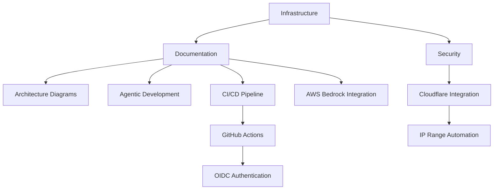

# LoreChatCDK Active Context

## Current Status
Phase 4: Documentation and Infrastructure Modernization

### Recent Updates
1. **Infrastructure Modernization**
   - Migrated from CloudFront + WAF to Cloudflare CDN + WAF
   - Implemented Cloudflare IP Updater Lambda function
   - Updated security groups to work with Cloudflare
   - Simplified WebSocket handling through Cloudflare
   - Maintained DNS validation for ACM certificates
   - Fixed Cloudflare IP Updater Lambda function to handle AWS security group rule limits using CIDR aggregation

2. **Technical Documentation Enhancement**
   - Updated architecture diagrams for Cloudflare integration
   - Implemented comprehensive data flow diagrams
   - Created hybrid search implementation details
   - Enhanced auto-scaling strategy documentation
   - Added data processing pipeline visualization
   - Added CI/CD pipeline documentation with GitHub Actions workflow
   - Added AWS Bedrock model integration instructions
   - Added AWS credentials and secrets management documentation

3. **Infrastructure Documentation**
   - Detailed Cloudflare configuration steps in DEVELOPMENT.md
   - WebSocket handling through Cloudflare
   - Auto-scaling implementation details
   - Service factory pattern examples
   - GitHub Actions OIDC authentication setup
   - Multi-repo workflow configuration
   - Secrets management with AWS Secrets Manager

4. **System Flow Documentation**
   - Request lifecycle sequence diagrams
   - Data processing flow visualization
   - Auto-scaling decision flow
   - Error handling strategies
   - CI/CD deployment flow

5. **Code Examples & Implementation**
   - WebSocket configuration snippets
   - Hybrid search implementation code
   - Auto-scaling configuration details
   - Data processing pipeline code
   - GitHub Actions workflow configuration

## Current Focus

### Completed

### In Progress
- Memory bank synchronization with new technical details
- Testing strategy implementation
- Technical deep dive expansion
- System flow diagram updates

### Recently Completed
1. **Infrastructure Modernization**
   - Cloudflare CDN + WAF integration
   - Cloudflare IP Updater Lambda implementation
   - Security group automation
   - WebSocket handling simplification
   - Documentation updates

2. **Technical Deep Dives**
   - WebSocket evolution documentation
   - Hybrid search implementation details
   - Auto-scaling strategy documentation
   - Data processing pipeline visualization
   - CI/CD pipeline documentation
   - AWS Bedrock model integration
   - AWS credentials and secrets management

3. **Implementation Details**
   - Cloudflare integration
   - Factory pattern implementations
   - Auto-scaling setup
   - Data processing optimizations
   - GitHub Actions workflow configuration
   - Multi-repo deployment flow

### Known Issues
1. **Documentation Maintenance**
   - Keeping technical details synchronized
   - Maintaining code example accuracy
   - Updating flow diagrams as system evolves
   - Balancing detail vs. readability

2. **Technical Depth**
   - Error handling documentation needs expansion
   - Performance optimization details to be added
   - Testing strategy documentation needed
   - Security implementation details to enhance

## Next Actions

### Immediate
1. Technical Documentation
   - Add error handling details
   - Expand testing strategies
   - Document performance optimizations
   - Test Cloudflare IP Updater Lambda function

2. System Flows
   - Add error recovery flows
   - Document scaling scenarios
   - Enhance monitoring flows
   - Update integration patterns

3. Testing Implementation
   - Implement unit tests for all stacks
   - Set up integration tests
   - Configure automated testing in CI/CD pipeline
   - Document testing strategy

### Short Term
1. Multi-region deployment planning
2. Enhanced disaster recovery
3. Voice interaction features
4. Multi-agentic workflows

## Technical Focus
- Testing implementation
- Infrastructure documentation
- Feature expansion
- Multi-region deployment

## Current Risks
1. **Documentation**
   - Technical detail accuracy
   - Code example maintenance
   - Diagram synchronization
   - Implementation clarity

2. **Technical Depth**
   - Balance of detail vs. accessibility
   - Code example completeness
   - System flow accuracy
   - Configuration coverage

3. **Testing**
   - Lack of comprehensive test suite
   - No automated testing in CI/CD pipeline
   - Limited test coverage
   - Manual testing overhead

4. **Future Updates**
   - Documenting system evolution
   - Updating technical decisions
   - Maintaining implementation details
   - Evolving architecture documentation
