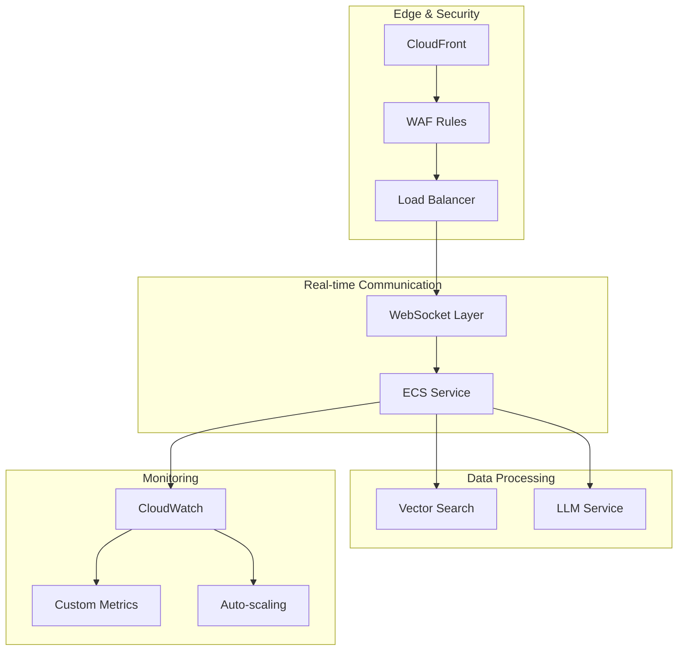
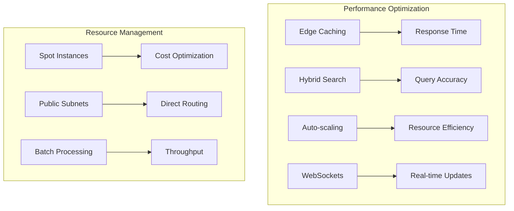
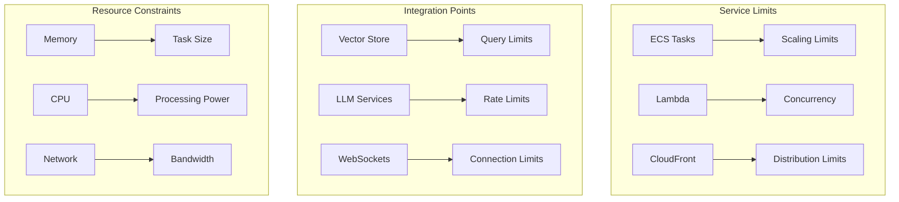

# LoreChatCDK Product Context

## Vision & Purpose
LoreChatCDK represents a modern approach to deploying AI-powered chat interfaces for website content. It combines infrastructure automation, security best practices, and cost optimization to deliver a reliable platform for conversational AI applications.

## Core Value Propositions

1. Infrastructure as Code (IaC) for consistent, repeatable deployments
2. Secure and properly configured AWS environment
3. Scalable architecture to handle varying loads
4. Integrated monitoring and alerting
5. Multi-environment support (dev, staging, prod)
6. Flexible LLM and Vector DB integrations
7. Multi-AZ reliability
8. Cost-effective resource usage
9. Comprehensive documentation

## Infrastructure Goals
- Reliable and resilient cloud architecture
- Secure communication between components
- Cost-effective resource utilization
- Simplified deployment and management
- Comprehensive monitoring and observability

## Key Infrastructure Patterns

### 1. Service Architecture


### 2. Core Patterns
1. Multi-stack separation of concerns
2. WebSocket-enabled edge architecture
3. Hybrid search implementation
4. Factory-based service abstraction
5. Intelligent auto-scaling
6. Comprehensive monitoring

### 3. Performance Architecture


### Scalability Implementation
- Dynamic resource allocation through ECS auto-scaling
- Intelligent metric-based scaling decisions
- Efficient WebSocket connection management
- Optimized vector search operations
- Cost-effective infrastructure design

## Development Philosophy

### 1. Infrastructure Design
```typescript
// Example: Factory Pattern Implementation
class LLMServiceFactory {
  static create(config: LLMConfig): ILLMService {
    switch (config.provider) {
      case 'openai':
        return new OpenAIService(config);
      case 'anthropic':
        return new AnthropicService(config);
      case 'bedrock':
        return new BedrockService(config);
      default:
        throw new Error(`Unsupported provider: ${config.provider}`);
    }
  }
}
```

### 2. Operational Architecture

```mermaid
graph TD
    subgraph "Infrastructure Management"
        A[CDK Deployment] --> B[Stack Updates]
        B --> C[Health Checks]
        C --> D[Monitoring]
    end
    
    subgraph "Auto Recovery"
        E[Issue Detection] --> F[Auto-scaling]
        F --> G[Health Restoration]
        G --> H[Verification]
    end
    
    subgraph "Cost Control"
        I[Resource Tracking] --> J[Budget Alerts]
        J --> K[Optimization]
        K --> L[Adjustment]
    end
```


## Success Metrics

### Technical Metrics
- Deployment success rate
- System availability
- Response latency
- Error rates
- Cache hit ratios

### Operational Metrics
- Resource utilization
- Cost per request
- Auto-scaling efficiency
- Security compliance

### Development Metrics
- Development velocity
- Documentation coverage
- Test coverage
- Issue resolution time

## Current State

### Implemented Features
- Multi-AZ deployment
- CloudFront + WAF security
- ECS Fargate with Spot
- Vector search integration
- LLM service abstraction

### Current Capabilities
- Multi-AZ deployment with WebSocket support
- Hybrid search implementation
- Intelligent auto-scaling
- Comprehensive monitoring
- Factory-based service abstraction

### Known Considerations
- Single region deployment (multi-region planned)
- Advanced monitoring refinement needed
- Performance optimization opportunities
- Enhanced testing coverage required

## Future Roadmap

### Near Term
- Multi-region deployment
- Enhanced disaster recovery
- Voice interaction support
- Multi-agentic workflows

### Long Term
- Global edge presence
- Advanced AI features
- Custom model support
- Enhanced analytics

## Technical Boundaries

### AWS Service Integration


### Development Considerations
- Systematic testing approach
- Documentation maintenance
- Performance monitoring
- Security compliance
- Cost optimization

### Integration Management
- API quota monitoring
- Service health tracking
- Resource optimization
- Performance tuning
- Cost analysis
