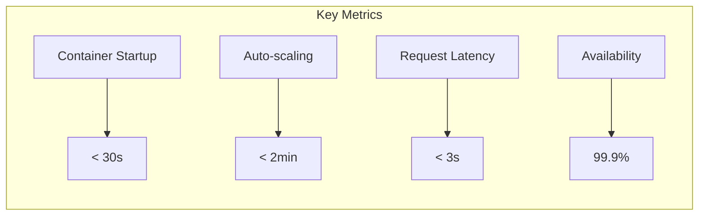

# LoreChatCDK Product Context

## Vision & Purpose
LoreChatCDK represents a modern approach to deploying AI-powered chat interfaces for website content. It combines infrastructure automation, security best practices, and cost optimization to deliver a reliable platform for conversational AI applications.

## Core Value Propositions

1. Infrastructure as Code (IaC) for consistent, repeatable deployments
2. Secure and properly configured AWS environment
3. Scalable architecture to handle varying loads
4. Integrated monitoring and alerting
5. Multi-environment support (dev, staging, prod)
6. Flexible LLM and Vector DB integrations
7. Multi-AZ reliability
8. Cost-effective resource usage
9. Comprehensive documentation

## Infrastructure Goals
- Reliable and resilient cloud architecture
- Secure communication between components
- Cost-effective resource utilization
- Simplified deployment and management
- Comprehensive monitoring and observability

## Key Infrastructure Patterns
1. Separation of concerns through multiple stacks
2. Secure networking with proper VPC configuration
3. Containerized deployment with ECS
4. Integrated monitoring and alerting
5. Secrets management for API keys

### Performance Targets

### Scalability Goals
- Support 1-10 concurrent users initially
- Scale to 1000s without architecture changes
- Efficient resource utilization
- Cost-proportional scaling

## Development Philosophy

### 1. Infrastructure Design
- Modular stack architecture
- Factory pattern implementations
- Secure by default
- Cost-optimized resources

### 2. Operational Model
- Self-healing infrastructure
- Automated scaling
- Comprehensive monitoring
- Proactive cost management

## Success Metrics

### Technical Metrics
- Deployment success rate
- System availability
- Response latency
- Error rates
- Cache hit ratios

### Operational Metrics
- Resource utilization
- Cost per request
- Auto-scaling efficiency
- Security compliance

### Development Metrics
- Development velocity
- Documentation coverage
- Test coverage
- Issue resolution time

## Current State

### Implemented Features
- Multi-AZ deployment
- CloudFront + WAF security
- ECS Fargate with Spot
- Vector search integration
- LLM service abstraction

### Known Limitations
- Single region deployment
- Manual production approvals
- AI debugging challenges
- WebSocket complexities
- Limited automated testing for infrastructure

## Future Roadmap

### Near Term
- Multi-region deployment
- Enhanced disaster recovery
- Voice interaction support
- Multi-agentic workflows

### Long Term
- Global edge presence
- Advanced AI features
- Custom model support
- Enhanced analytics

## Technical Boundaries

### AWS Constraints
- Service quotas
- Regional availability
- Cost structures
- Feature limitations

### Development Constraints
- AI agent capabilities
- Memory bank maintenance
- Documentation overhead
- Testing complexity

### Integration Constraints
- API rate limits
- CI/CD pipeline integration
- Model availability
- Vector DB scaling
- Cost considerations
