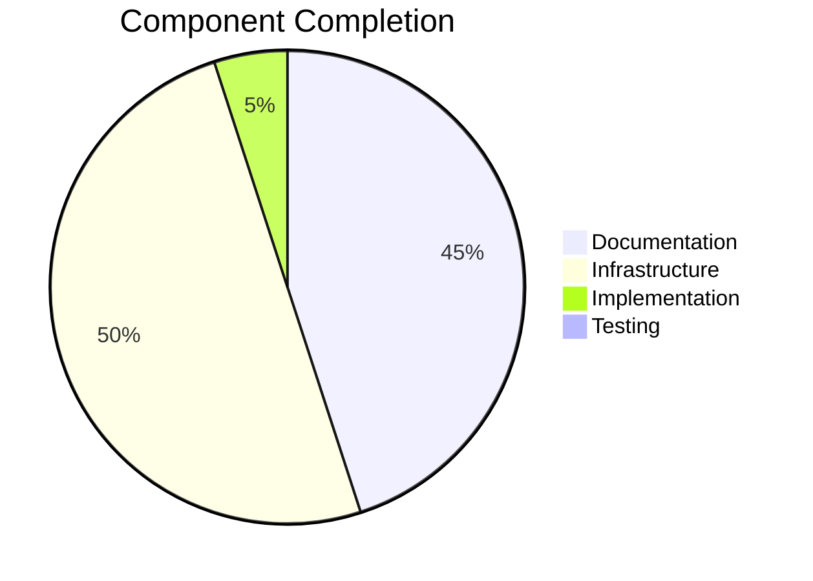

# LoreChatCDK Progress Tracker

## Project Status: Phase 4 - Documentation and Agentic Development Integration

### Development Progress

## Completed Features

### Infrastructure Stack
- ✅ Multi-AZ VPC with public subnets
- ✅ CloudFront distribution with caching
- ✅ WAF configuration with rate limiting
- ✅ Route 53 and SSL/TLS setup
- ✅ Security groups (CloudFront IPs only)
- ✅ Websocket connection support

### Service Stack
- ✅ ECS Fargate cluster with Spot instances
- ✅ Internal Application Load Balancer
- ✅ Auto-scaling configuration (1-4 instances)
- ✅ Task definition (0.25 vCPU, 512MB RAM)
- ✅ Log group with 1-week retention
- ✅ Secrets Manager integration

### Data Stack
- ✅ S3 buckets for data storage
- ✅ Data processing Lambda with HTML content extraction
  * Structured content extraction (title, source, etc.)
  * Markdown conversion
  * JSONL output format
  * Error handling and reporting
- ✅ Vectorization Lambda with metadata preservation
  * JSONL processing
  * Bedrock embeddings generation
  * Metadata-rich vector storage
  * Per-item error handling
- ✅ Upstash Vector integration
  * Vector storage with metadata
  * Unique vector IDs
  * Source traceability
- ✅ FAISS development setup

### Monitoring Stack
- ✅ CloudWatch dashboards for key metrics
- ✅ CPU and Memory alarms
- ✅ VPC Flow Logs
- ✅ AWS Budgets setup
- ✅ Cost tagging strategy

### Development Tools
- ✅ Memory bank structure
- ✅ AI agent workflows
- ✅ Documentation templates
- ✅ Development guidelines

## In Progress

### Testing Enhancement
- [ ] Unit tests for all stacks
- [ ] Integration tests
- [ ] Load testing
- [ ] Security testing

### Documentation Updates
- [ ] Memory bank sync
- [ ] Deployment procedures
- [ ] Operational guides
- [ ] Security practices

## Known Issues

### High Priority
- [ ] Complete testing suite
- [ ] Memory bank synchronization

### Medium Priority
- [ ] Multi-region deployment planning
- [ ] Voice interaction features
- [ ] Multi-agentic workflows

## Next Actions

### Immediate
1. Testing
   - Implement comprehensive test suite
   - Document testing strategy
   - Set up automated testing

2. Documentation
   - Sync memory bank content
   - Complete operational guides

3. Development Process
   - Refine AI workflows
   - Optimize model selection
   - Enhance documentation practices

### Short-term
1. Feature Enhancement
   - Plan multi-region deployment
   - Design voice interactions
   - Develop multi-agentic flows

## Testing Status
- [ ] CDK unit tests (Planned)
- [ ] Infrastructure tests (Planned)
- [ ] Integration tests (Planned)
- [ ] Deployment tests (Planned)
- [ ] Load testing (Future)

## Development Metrics
- Memory bank coverage: 90%
- Documentation completeness: 90%
- Test coverage: 0%
- Development velocity: High

## Production Readiness
- Infrastructure: Complete
- Security: Implemented
- Monitoring: Established
- Documentation: Near complete
- Testing: In progress
