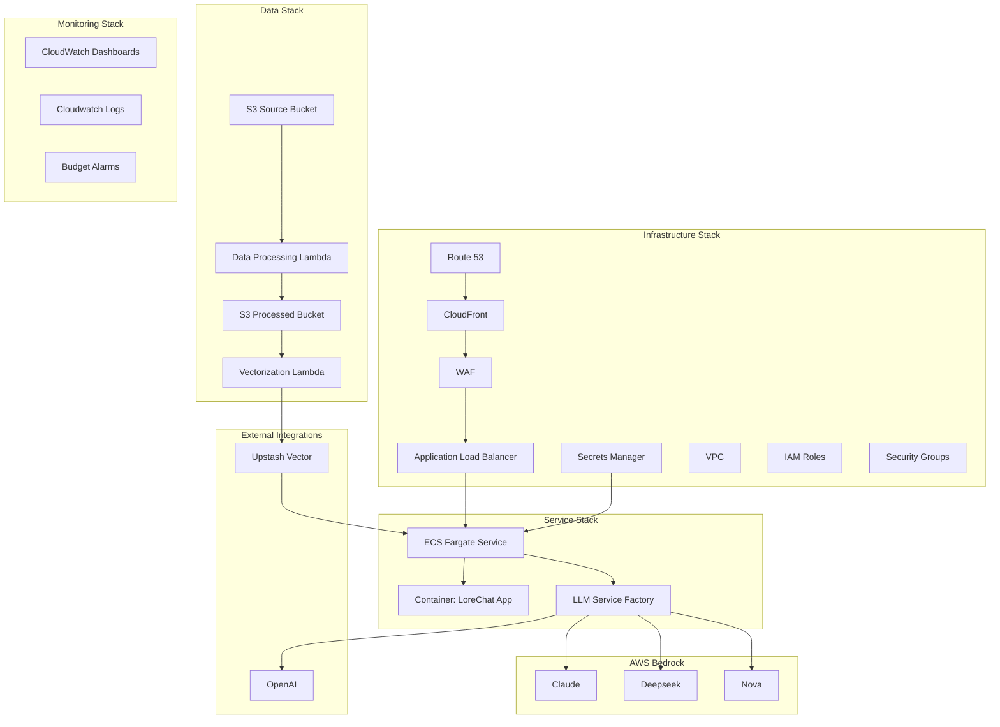
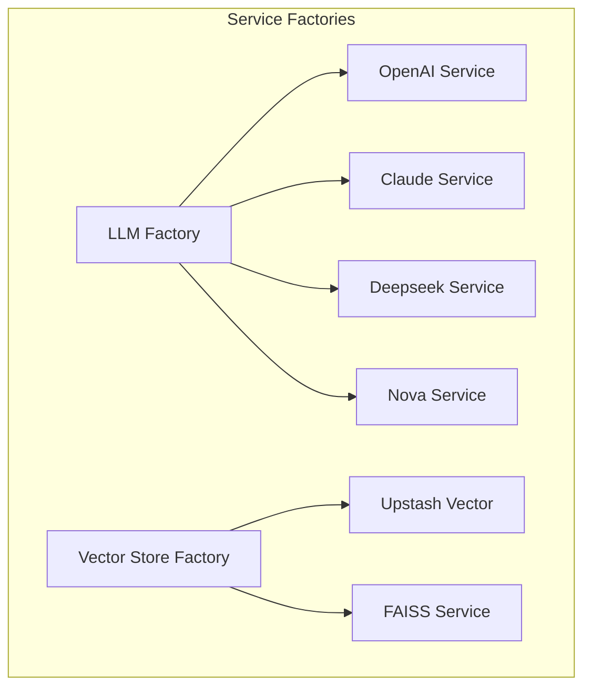
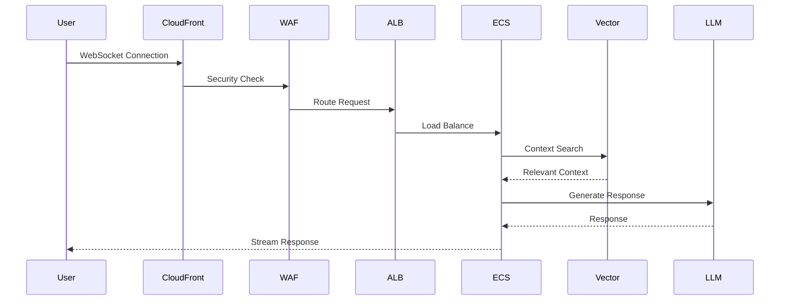
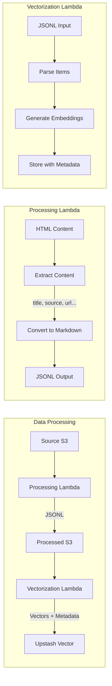
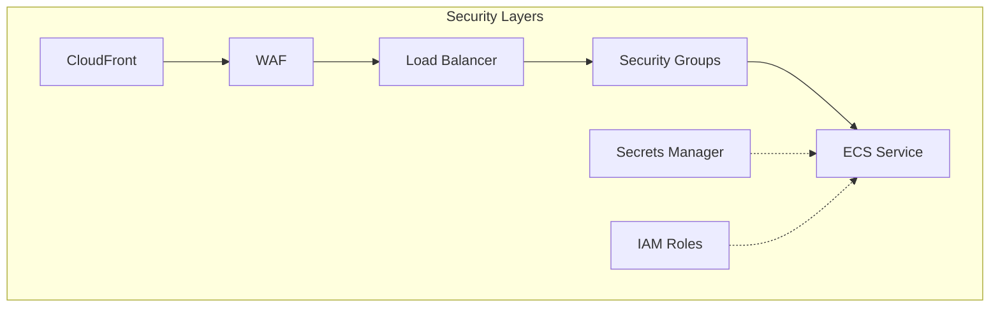
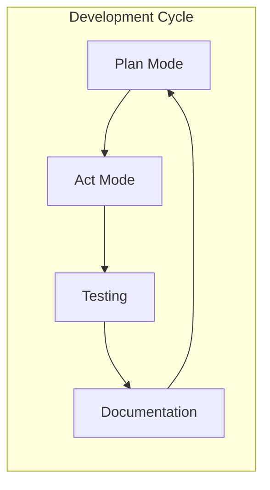
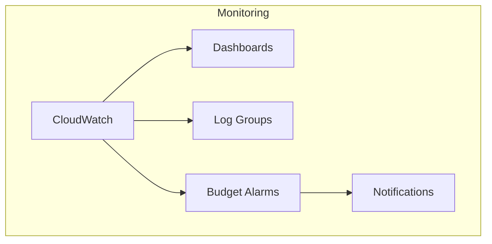

# LoreChatCDK System Patterns

## Core Architecture

### System Overview

## Core Design Patterns

### 1. Factory Pattern Implementation

### 2. Request Flow

### 3. Data Processing Pipeline

#### Pipeline Components

1. **Data Processing Lambda**
   - Input: HTML content from source bucket
   - Processing:
     * Extracts structured content (title, source_text, source_link)
     * Converts content to markdown format
     * Handles both single files and JSONL batches
   - Output: JSONL files with fields:
     * title, source_text, source_link
     * url, content_type, extracted_at
     * markdown content
   - Storage: Processed bucket with "processed/" prefix

2. **Vectorization Lambda**
   - Input: JSONL files from processed bucket
   - Processing:
     * Parses each JSONL item individually
     * Uses markdown content for embedding generation
     * Creates unique vector IDs
   - Vector Storage:
     * Stores embeddings in Upstash Vector
     * Includes metadata fields from input
     * Maintains source traceability
   - Error Handling:
     * Processes items independently
     * Tracks success/failure per item
     * Continues on individual item failures

3. **Data Flow**
   - Source S3 → Processing Lambda (HTML → JSONL)
   - Processed S3 → Vectorization Lambda (JSONL → Vectors)
   - Upstash Vector (Final Storage with Metadata)

### 4. Security Architecture

## Implementation Patterns

### 1. Stack Organization
- Infrastructure Stack: Network and security components
- Service Stack: Application runtime and containers
- Data Stack: Storage and processing pipeline
- Monitoring Stack: Observability and cost tracking

### 2. Development Workflow

### 3. Key Design Principles
- Factory pattern for service abstraction
- Multi-AZ deployment for reliability
- Public subnet design with strict security
- Comprehensive monitoring and logging
- Cost-effective resource utilization

### 4. Resource Management
- Auto-scaling based on demand
- Spot instances for cost optimization
- CloudFront caching for performance
- Efficient vector storage solution
- Modular stack deployment

## Operational Patterns

### 1. Monitoring Strategy

### 2. Cost Management
- Resource tagging for cost allocation
- Budget monitoring and alerts
- Spot instance usage
- Efficient resource sizing
- Cache optimization

### 3. Security Implementation
- WAF rules and rate limiting
- Security group restrictions
- IAM least privilege
- Secrets management
- Encryption at rest and in transit

### 4. Development Practices
- Memory bank documentation
- Model-specific task allocation
- Plan-then-act workflow
- Continuous documentation
- Systematic testing approach
