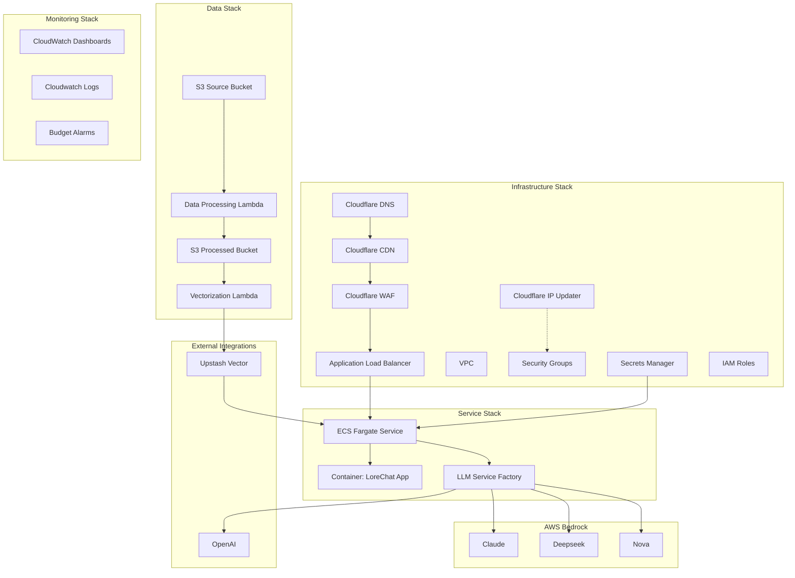
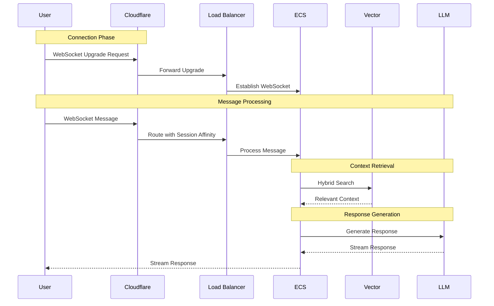
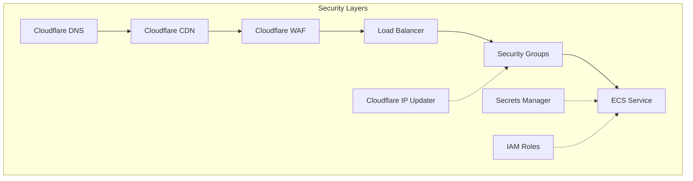
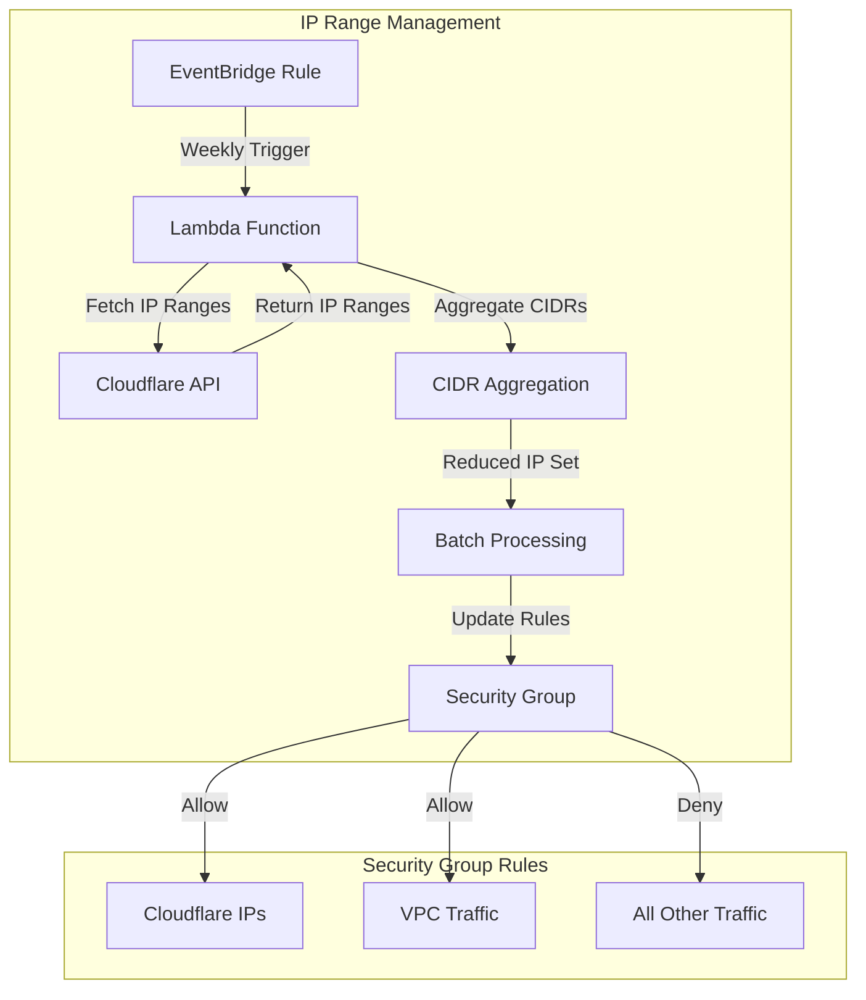

# LoreChatCDK System Patterns

## Core Architecture

### System Overview


## Core Design Patterns

### 1. Factory Pattern Implementation


### 2. Request Flow & WebSocket Handling


**Cloudflare WebSocket Configuration:**
WebSocket support is enabled through the Cloudflare dashboard under Network → WebSockets.

### 3. Enhanced Data Processing Pipeline


**Processing Implementation:**
```typescript
// Optimized processing pipeline
class ContentProcessor {
  async process(content: string): Promise<ProcessedContent> {
    // Semantic splitting with overlap
    const chunks = await this.splitContent(content, {
      chunkSize: 1000,
      overlap: 100,
      preserveStructure: true
    });
    
    // Parallel processing with batching
    const batchSize = 50;
    const batches = this.createBatches(chunks, batchSize);
    
    const results = await Promise.all(
      batches.map(batch => this.processBatch(batch))
    );
    
    return this.assembleResults(results);
  }
}
```

#### Pipeline Components

1. **Data Processing Lambda**
   - Input: HTML content from source bucket
   - Processing:
     * Extracts structured content (title, source_text, source_link)
     * Converts content to markdown format
     * Handles both single files and JSONL batches
   - Output: JSONL files with fields:
     * title, source_text, source_link
     * url, content_type, extracted_at
     * markdown content
   - Storage: Processed bucket with "processed/" prefix

2. **Vectorization Lambda**
   - Input: JSONL files from processed bucket
   - Processing:
     * Parses each JSONL item individually
     * Uses markdown content for embedding generation
     * Creates unique vector IDs
   - Vector Storage:
     * Stores embeddings in Upstash Vector
     * Includes metadata fields from input
     * Maintains source traceability
   - Error Handling:
     * Processes items independently
     * Tracks success/failure per item
     * Continues on individual item failures

3. **Data Flow**
   - Source S3 → Processing Lambda (HTML → JSONL)
   - Processed S3 → Vectorization Lambda (JSONL → Vectors)
   - Upstash Vector (Final Storage with Metadata)

### 4. Security Architecture


### 5. Cloudflare IP Updater Pattern with CIDR Aggregation


**Cloudflare IP Updater Implementation:**
```typescript
// Lambda function to update security group with Cloudflare IP ranges
export class CloudflareIpUpdater extends Construct {
  constructor(scope: Construct, id: string, props: CloudflareIpUpdaterProps) {
    super(scope, id);
    
    // Create Lambda function
    const updaterFunction = new lambda.Function(
      this,
      "CloudflareIpUpdaterFunction",
      {
        runtime: lambda.Runtime.NODEJS_18_X,
        handler: "index.handler",
        code: lambda.Code.fromAsset(
          path.join(__dirname, "../../lambda/cloudflare_ip_updater")
        ),
        timeout: cdk.Duration.minutes(5),
        environment: {
          SECURITY_GROUP_ID: props.securityGroup.securityGroupId,
          PORTS: props.ports.join(","),
        },
      }
    );
    
    // Schedule weekly updates
    new events.Rule(this, "ScheduleRule", {
      schedule: events.Schedule.rate(cdk.Duration.days(7)),
      targets: [new targets.LambdaFunction(updaterFunction)],
    });
  }
}
```

**CIDR Aggregation Implementation:**
```javascript
// Lambda function with CIDR aggregation to stay under AWS limits
const { aggregate } = require('cidr-tools');

// Aggregate the new CIDR ranges to reduce the number of rules
const aggregatedRanges = aggregate(newRanges);
console.log(`Aggregated ${newRanges.length} Cloudflare IP ranges into ${aggregatedRanges.length} CIDR blocks`);

// Process in batches to stay under AWS limits
for (let i = 0; i < cidrsToAdd.length; i += MAX_RULES_PER_BATCH) {
  const batchCidrs = cidrsToAdd.slice(i, i + MAX_RULES_PER_BATCH);
  // Update security group with batch
}
```

## Implementation Patterns

### 1. Stack Organization
- Infrastructure Stack: Network and security components
- Service Stack: Application runtime and containers
- Data Stack: Storage and processing pipeline
- Monitoring Stack: Observability and cost tracking

### 2. Development Workflow


### 3. Key Design Principles
- Factory pattern for service abstraction
- Multi-AZ deployment for reliability
- Public subnet design with strict security
- Comprehensive monitoring and logging
- Cost-effective resource utilization

### 4. Auto-scaling Strategy


**Auto-scaling Configuration:**
```typescript
// Advanced auto-scaling setup
const scaling = service.autoScaleTaskCount({
  maxCapacity: 4,
  minCapacity: 1
});

// CPU-based scaling
scaling.scaleOnCpuUtilization('CpuScaling', {
  targetUtilizationPercent: 70,
  scaleInCooldown: Duration.seconds(60),
  scaleOutCooldown: Duration.seconds(30)
});

// Request count scaling
scaling.scaleOnRequestCount('RequestScaling', {
  targetRequestsPerSecond: 100,
  scaleInCooldown: Duration.seconds(60),
  scaleOutCooldown: Duration.seconds(30)
});
```

## Operational Patterns

### 1. Enhanced Monitoring Strategy


### 2. Cost Management
- Resource tagging for cost allocation
- Budget monitoring and alerts
- Spot instance usage
- Efficient resource sizing
- Cache optimization

### 3. Security Implementation
- Cloudflare WAF with Bot Fight Mode
- Automated security group updates with Cloudflare IP ranges
- IAM least privilege
- Secrets management
- Encryption at rest and in transit (Full Strict SSL/TLS mode)

### 4. Development Practices
- Memory bank documentation
- Model-specific task allocation
- Plan-then-act workflow
- Continuous documentation
- Systematic testing approach
