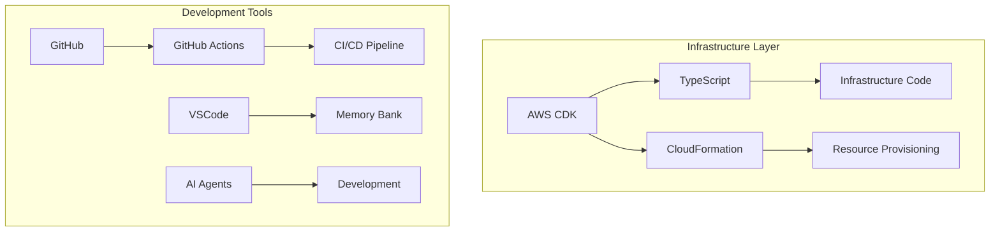
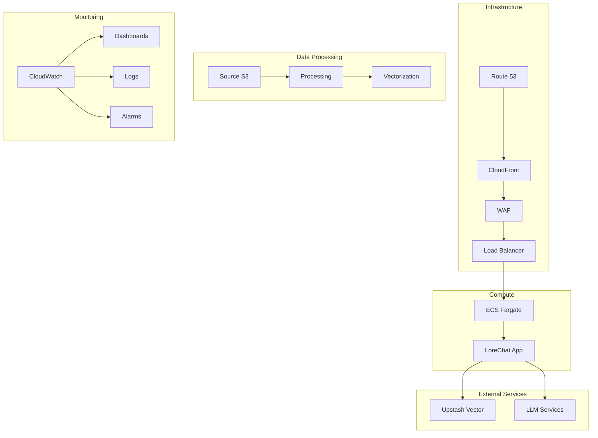
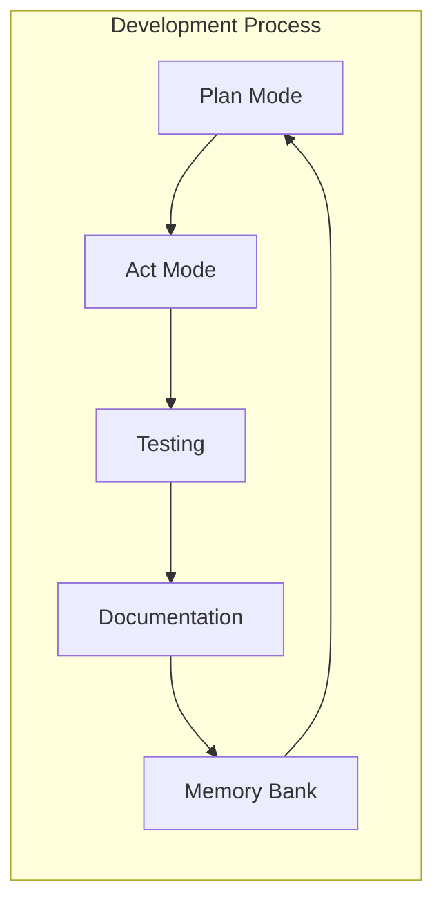

# LoreChatCDK Technical Context

## Technology Stack

### Core Technologies

### Key Dependencies
- AWS CDK >= 2.100.0
- TypeScript >= 5.0.0
- AWS SDK >= 3.0.0
- Jest >= 29.0.0
- ESLint >= 8.0.0
- Node.js >= 18.x
- npm >= 9.x
- AWS CLI >= 2.x

### Development Environment
- VSCode with AWS Toolkit
- Memory Bank Integration
- AI Agent Support
- Local Development Tools

## Service Architecture

### AWS Service Integration

### Development Workflow

## Technical Implementation

### 1. Infrastructure Components
- Multi-AZ deployment with public subnets
- CloudFront + WAF for security and caching
- ECS Fargate with Spot instances
- S3-based data processing pipeline
- Upstash Vector for vector storage

### 2. Security Implementation
- WAF rules and rate limiting
- Security group restrictions
- IAM least privilege model
- Secrets Manager integration
- Encryption at rest and in transit

### 3. Development Practices
- Memory bank documentation
- AI agent collaboration
- Plan-then-act workflow
- Continuous documentation
- Systematic testing

### 4. Resource Management
- Auto-scaling configuration
- Spot instance optimization
- CloudFront caching
- Lambda concurrency limits
- S3 lifecycle policies

## Technical Constraints

### 1. AWS Service Limits
- ECS task limits
- CloudFront distribution limits
- Lambda concurrency
- S3 event notifications
- API rate limits

### 2. Development Constraints
- AI agent limitations
- Memory bank maintenance
- Documentation overhead
- Testing requirements
- Security compliance

### 3. Cost Considerations
- Multi-AZ requirements
- Spot instance availability
- CloudFront pricing
- Vector storage costs
- Lambda execution

## Deployment
- CDK Deployment: `cdk deploy --all` or `cdk deploy StackName`
- Stack Order: Infrastructure → LLM → Service → Monitoring
- Environment Management: Context values in cdk.json
- Rollback Strategy: CloudFormation automatic rollback on failure

## Resource Management
- VPC: Dual AZ (required for ALB), public subnets only, no NAT Gateways
- ECS: Fargate Spot, minimal compute (0.5 vCPU, 1024MB RAM), auto-scaling (1-4 instances)
- Security: Least privilege IAM, CloudFront-only security groups, WAF rate limiting, S3 bucket policies
- Storage: Upstash Vector for efficient vector storage, S3 for raw and processed data
- Compute: Lambda functions for data processing and vectorization
- Monitoring: 1-week log retention, CloudWatch dashboards, VPC Flow Logs
- Caching: CloudFront with separate policies for static assets and API responses

## Development Guidelines
- CDK Best Practices: L2 constructs, cross-stack references, proper tagging
- Security Best Practices: Least privilege IAM, WAF protection, Secrets Manager, S3 bucket policies
- Cost Optimization: Free tier resources, Fargate Spot, CloudFront caching, minimal AZ count (2), efficient Lambda execution
- Maintainability: Clear stack separation, comprehensive documentation, memory bank updates
- Data Processing: Efficient Lambda functions, proper error handling and retries
- Vector Storage: Optimal use of Upstash Vector for fast and cost-effective vector operations
