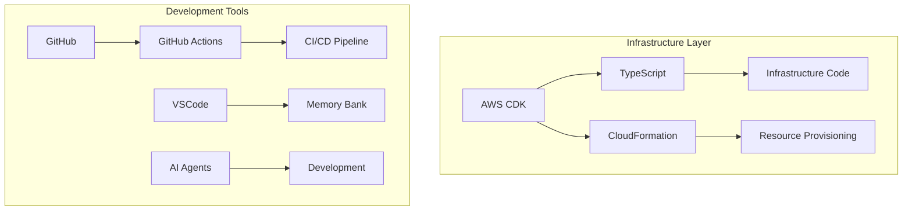
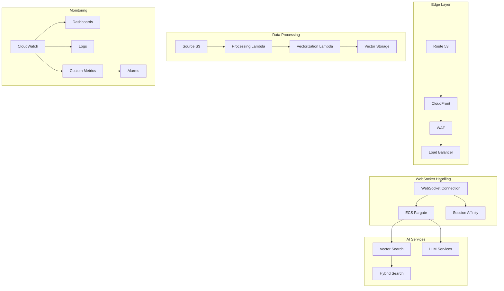
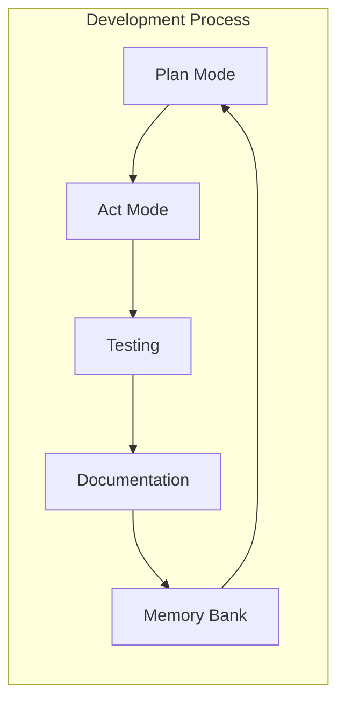

# LoreChatCDK Technical Context

## Technology Stack

### Core Technologies


### Key Dependencies
- AWS CDK >= 2.100.0
- TypeScript >= 5.0.0
- AWS SDK >= 3.0.0
- Jest >= 29.0.0
- ESLint >= 8.0.0
- Node.js >= 18.x
- npm >= 9.x
- AWS CLI >= 2.x

### Development Environment
- VSCode with AWS Toolkit
- Memory Bank Integration
- AI Agent Support
- Local Development Tools

## Service Architecture

### AWS Service Integration & Data Flow


### WebSocket Configuration
```typescript
// CloudFront WebSocket setup
const webSocketBehavior = new cloudfront.BehaviorOptions({
  allowedMethods: cloudfront.AllowedMethods.ALLOW_ALL,
  originRequestPolicy: new cloudfront.OriginRequestPolicy(this, 'WebSocketPolicy', {
    headerBehavior: cloudfront.OriginRequestHeaderBehavior.allowList(
      'Sec-WebSocket-Key',
      'Sec-WebSocket-Version',
      'Sec-WebSocket-Protocol',
      'Sec-WebSocket-Accept'
    ),
    queryStringBehavior: cloudfront.OriginRequestQueryStringBehavior.all()
  })
});

// ALB WebSocket target group
const webSocketTargetGroup = new elbv2.ApplicationTargetGroup(this, 'WebSocketGroup', {
  vpc,
  protocol: elbv2.ApplicationProtocol.HTTP,
  targetType: elbv2.TargetType.IP,
  healthCheck: {
    path: '/health',
    timeout: Duration.seconds(5),
    interval: Duration.seconds(30)
  }
});
```

### Development Workflow


## Technical Implementation

### 1. Infrastructure Components

#### Edge & Network Layer
- Multi-AZ deployment with public subnets
- CloudFront + WAF for security and caching
- Custom WebSocket configuration
- Session affinity for connections

#### Compute Layer
- ECS Fargate with Spot instances
- Auto-scaling based on multiple metrics
- Task definition optimization
- Resource utilization monitoring

#### Data Processing
- S3-based processing pipeline
- Optimized chunking strategy
- Parallel processing implementation
- Error handling and recovery

#### Search Implementation
```typescript
// Hybrid search configuration
class HybridSearchService implements SearchService {
  async search(query: string): Promise<SearchResult[]> {
    // Generate embeddings
    const denseVector = await this.embeddings.embedQuery(query);
    const sparseVector = this.generateSparseVector(query);
    
    // Parallel search execution
    const [denseResults, sparseResults] = await Promise.all([
      this.denseSearch(denseVector),
      this.sparseSearch(sparseVector)
    ]);
    
    // Reciprocal Rank Fusion
    return this.fuseResults(denseResults, sparseResults);
  }
}
```

### 2. Security Implementation
- WAF rules and rate limiting
- Security group restrictions
- IAM least privilege model
- Secrets Manager integration
- Encryption at rest and in transit

### 3. Development Practices
- Memory bank documentation
- AI agent collaboration
- Plan-then-act workflow
- Continuous documentation
- Systematic testing

### 4. Resource Management
- Auto-scaling configuration
- Spot instance optimization
- CloudFront caching
- Lambda concurrency limits
- S3 lifecycle policies

## Technical Constraints

### 1. AWS Service Limits
- ECS task limits
- CloudFront distribution limits
- Lambda concurrency
- S3 event notifications
- API rate limits

### 2. Development Constraints
- AI agent limitations
- Memory bank maintenance
- Documentation overhead
- Testing requirements
- Security compliance

### 3. Cost Considerations
- Multi-AZ requirements
- Spot instance availability
- CloudFront pricing
- Vector storage costs
- Lambda execution


## Deployment
- CDK Deployment: `cdk deploy --all` or `cdk deploy StackName`
- Stack Order: Infrastructure → LLM → Service → Monitoring
- Environment Management: Context values in cdk.json
- Rollback Strategy: CloudFormation automatic rollback on failure

## Resource Management

### Compute Resources
```typescript
// ECS Task Definition
const taskDefinition = new ecs.FargateTaskDefinition(this, 'TaskDef', {
  cpu: 256,
  memoryLimitMiB: 512,
  ephemeralStorageGiB: 21
});

// Auto-scaling configuration
const scaling = service.autoScaleTaskCount({
  maxCapacity: 4,
  minCapacity: 1
});

scaling.scaleOnCpuUtilization('CpuScaling', {
  targetUtilizationPercent: 70,
  scaleInCooldown: Duration.seconds(60),
  scaleOutCooldown: Duration.seconds(30)
});

scaling.scaleOnRequestCount('RequestScaling', {
  targetRequestsPerSecond: 100
});
```

### Infrastructure Resources
- VPC: Dual AZ, public subnets, no NAT Gateways
- ECS: Fargate Spot, optimized compute settings
- Security: Least privilege IAM, CloudFront-only access
- Storage: Hybrid vector search implementation
- Compute: Optimized Lambda configurations
- Monitoring: Enhanced CloudWatch integration
- Caching: Intelligent CloudFront policies

## Development Guidelines

### Infrastructure as Code
- CDK Best Practices: L2 constructs, cross-stack references
- Type-safe infrastructure with proper interfaces
- Reusable component patterns
- Automated testing capabilities

### Security Implementation
```typescript
// Security group configuration
const securityGroup = new ec2.SecurityGroup(this, 'ServiceSG', {
  vpc,
  description: 'Security group for LoreChat service',
  allowAllOutbound: false
});

// CloudFront-only access
securityGroup.addIngressRule(
  ec2.Peer.ipv4(cloudFrontIp),
  ec2.Port.tcp(443),
  'Allow HTTPS from CloudFront'
);

// WAF configuration
const waf = new wafv2.CfnWebACL(this, 'WAF', {
  defaultAction: { allow: {} },
  scope: 'CLOUDFRONT',
  visibilityConfig: {
    cloudWatchMetricsEnabled: true,
    metricName: 'WAFMetrics',
    sampledRequestsEnabled: true
  },
  rules: [
    // Rate limiting
    {
      name: 'RateLimit',
      priority: 1,
      action: { block: {} },
      statement: {
        rateBasedStatement: {
          limit: 2000,
          aggregateKeyType: 'IP'
        }
      },
      visibilityConfig: {
        cloudWatchMetricsEnabled: true,
        metricName: 'RateLimitMetric',
        sampledRequestsEnabled: true
      }
    }
  ]
});
```

### Resource Optimization
- Free tier resource utilization
- Spot instance management
- Efficient Lambda execution
- Optimized vector operations
- Smart caching strategies

### Development Workflow
- Clear stack separation
- Comprehensive documentation
- Memory bank synchronization
- Systematic testing approach
- Performance monitoring
